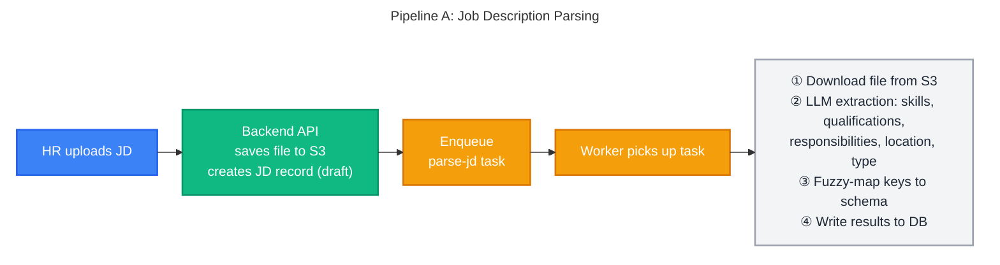
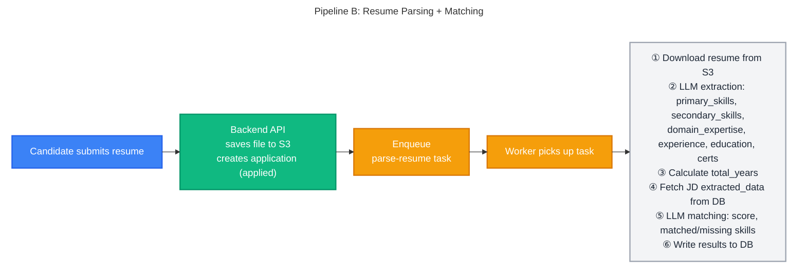
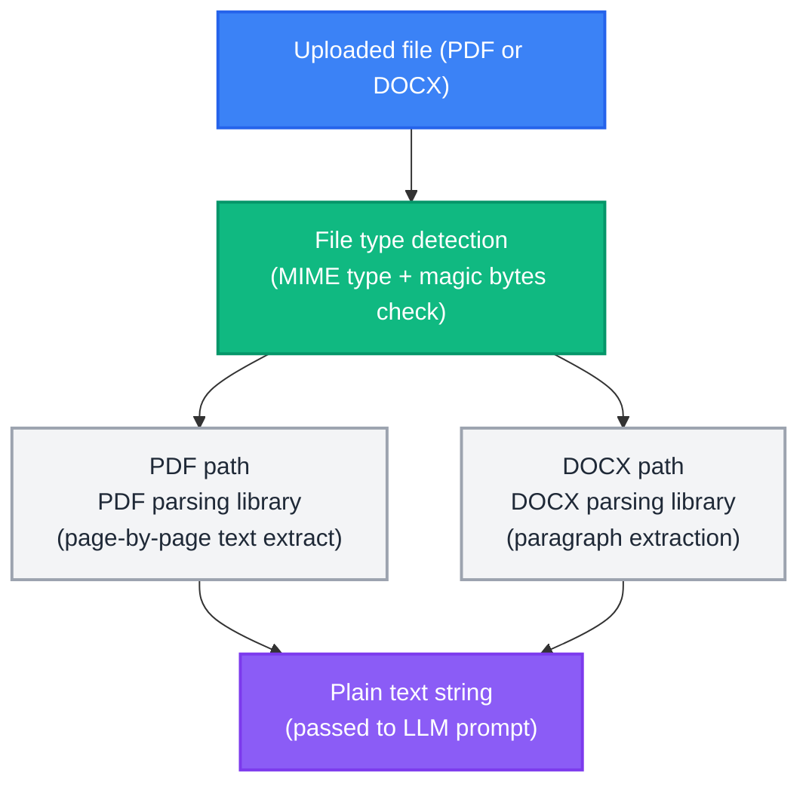

# AI Processing Pipeline - AI-Powered Recruitment Platform

> **Source of Truth**: This document is the authoritative reference for AI pipeline architecture, prompt engineering, extraction schemas, matching/scoring logic, and document parsing.
>
> For the overall system architecture and workflow diagrams, see [SYSTEM_DESIGN.md](../architecture/SYSTEM_DESIGN.md) §7 Workflows.
> For JSONB schema definitions stored in the database, see [DB_DESIGN.md](../architecture/DB_DESIGN.md) §5.

---

## Table of Contents

1. [Pipeline Overview](#1-pipeline-overview)
2. [AI Prompt Engineering](#2-ai-prompt-engineering)
3. [Matching Score Formula](#3-matching-score-formula)
4. [Document Parsing](#4-document-parsing)
5. [Task Execution & Chaining](#5-task-execution--chaining)

---

## 1. Pipeline Overview

There are two AI pipelines for Phase 1. Both follow the same pattern: **API enqueues task → broker delivers → worker processes → worker writes results to DB**.





---

## 2. AI Prompt Engineering

The system sends structured prompts to the LLM for each processing step. The prompts are designed to always return **valid JSON** so the output can be stored directly as JSONB in the database.

### Job Description Extraction

**Input**: Raw JD text (extracted from uploaded document or fetched from URL)

**Prompt instructs the LLM to extract**:

| Field | Type | Description |
|-------|------|-------------|
| `required_skills` | array | Must-have skills explicitly stated |
| `preferred_skills` | array | Good-to-have or bonus skills |
| `minimum_experience_years` | number | Minimum years explicitly mentioned |
| `preferred_experience_years` | number | Preferred/ideal years if mentioned |
| `education_requirements` | array | Degrees required |
| `certifications` | array | Professional certifications required or preferred |
| `job_type` | string | full-time / part-time / contract / internship |
| `work_mode` | string | remote / hybrid / on-site |
| `location` | string | City and country if mentioned |
| `salary_range` | object | min, max, currency if mentioned |
| `responsibilities` | array | Key duties of the role |
| `role_summary` | string | 2-3 sentence overview |

**Constraints applied in prompt**: Return `null` for any field not explicitly found. Do not infer or hallucinate values.

---

### Resume Extraction

**Input**: Raw text extracted from PDF or DOCX resume file

**Prompt instructs the LLM to extract**:

| Field | Type | Description |
|-------|------|-------------|
| `candidate_summary` | string | 2-3 sentence professional summary |
| `primary_skills` | array | Core technical skills |
| `secondary_skills` | array | Supporting technical skills |
| `domain_expertise` | array | Industry/domain knowledge |
| `experience` | array | Each role: company, title, start/end date, responsibilities |
| `total_experience_years` | number | Calculated from all roles (no overlaps) |
| `education` | array | Degree, field, institution, year |
| `certifications` | array | Named certifications |
| `languages` | array | Languages with proficiency level |

**Constraints applied in prompt**: Calculate `total_experience_years` accurately accounting for overlapping roles. Do not count current employer tenure beyond the present date.

---

### Candidate-JD Matching

**Input**: JD `extracted_data` JSONB + Resume `parsed_data` JSONB (both already stored in DB)

**Prompt instructs the LLM to compare and score**:

| Output field | Type | Description |
|-------------|------|-------------|
| `skills_match.score` | 0.0-1.0 | Fraction of required skills matched |
| `skills_match.matched_skills` | array | Skills found in both JD and resume |
| `skills_match.missing_skills` | array | JD required skills absent from resume |
| `experience_match.score` | 0.0-1.0 | Experience level match |
| `experience_match.years_required` | number | From JD |
| `experience_match.years_candidate_has` | number | From resume |
| `education_match.score` | 0.0-1.0 | Education requirements met |
| `education_match.meets_requirements` | boolean | Whether minimum education requirements are satisfied |
| `overall_fit.score` | 0.0-10.0 | Weighted overall match |
| `overall_fit.recommendation` | string | strong_fit / moderate_fit / weak_fit / not_suitable |
| `overall_fit.strengths` | array | Notable positives |
| `overall_fit.concerns` | array | Notable gaps |
| `overall_fit.summary` | string | 2-3 paragraph analysis |

> **Human-in-the-loop**: The AI matching score is an advisory signal, not an automated decision. No candidate is automatically rejected based on matching score alone. HR must explicitly review and confirm every status transition.

---

## 3. Matching Score Formula

The final `matching_score` (0-10) stored on the application is a weighted average of the three sub-scores:

```
  matching_score =
      ( skills_match.score    × 0.40
      + experience_match.score × 0.35
      + education_match.score  × 0.25 ) × 10
```

| Weight | Dimension | Rationale |
|--------|-----------|-----------|
| 40% | Skills match | Most direct signal of capability |
| 35% | Experience match | Seniority and role relevance |
| 25% | Education match | Threshold signal, not a differentiator |

The score is stored as a denormalised `float` column on the applications table to allow fast `ORDER BY matching_score DESC` queries without re-computing.

> **Edge case**: If a dimension cannot be evaluated (e.g., the JD has no education requirements), that dimension scores 0 for the component. This ensures the formula always produces a valid result.

---

## 4. Document Parsing

Before the LLM can extract structured data, the raw file must be converted to plain text. The document parser handles this step:



Supported input formats: PDF, DOCX. Files are validated by MIME type and magic byte signature - not just file extension - before processing begins.

---

## 5. Task Execution & Chaining

### Task Types

| Task | Input | Output | Status Update |
|------|-------|--------|---------------|
| `parse-jd` | JD record ID | `extracted_data` JSONB | `draft` → `processing` → `draft_parsed` (or `extraction_failed`) |
| `parse-resume` | Application ID | `parsed_data` JSONB | `applied` → `processing` |
| `match-candidate` | Application ID | `matching_result` JSONB, `matching_score`, `years_of_experience` | `processing` → `screened` |
| `send-email` | Template + recipient | Email sent | N/A |

### Task Chaining

The `parse-resume` and `match-candidate` tasks are chained:
1. When `parse-resume` completes successfully, it automatically enqueues `match-candidate` for the same application
2. `match-candidate` fetches the JD's `extracted_data` from the database
3. Runs the LLM matching prompt
4. Writes `matching_result`, `matching_score`, and `years_of_experience` to the application record
5. Updates application status to `screened`

### Reliability

| Concern | Approach |
|---------|----------|
| Retry policy | 3 retries with exponential backoff (e.g. 30s, 120s, 300s) |
| Dead-letter queue | Failed tasks after max retries go to DLQ for investigation |
| Idempotency | Tasks check current record status before processing - safe to re-run |
| Observability | Task start, completion, and failure all written to application logs |
