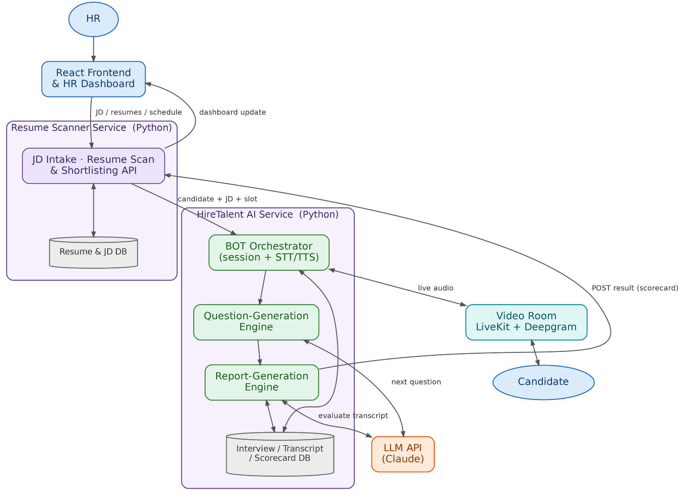
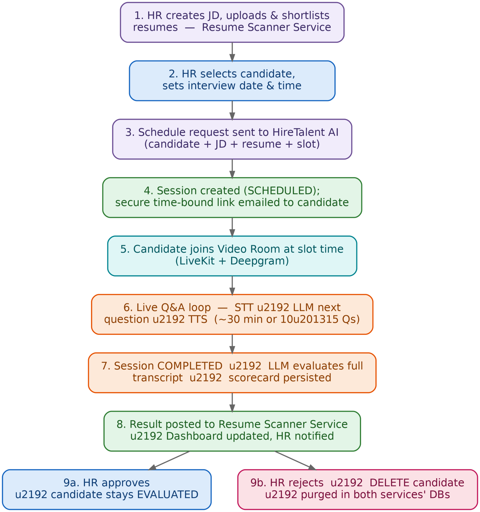
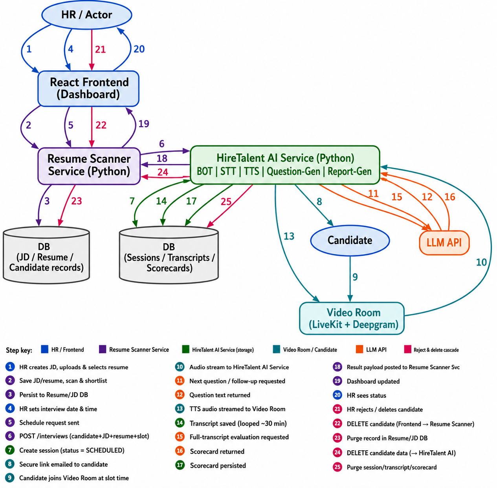
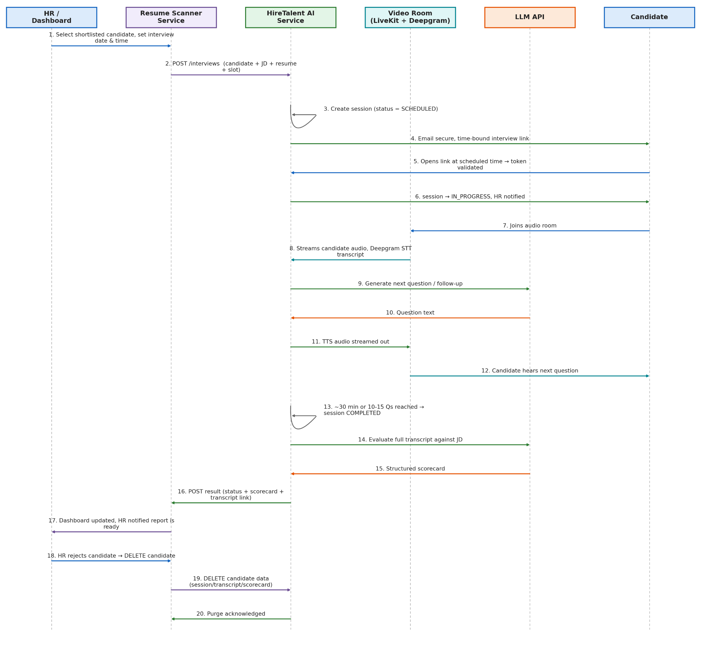

**HireTalent AI --- Interview Bot Service**

HireTalent AI Service

*Requirements & Architecture Document --- v3 (React + Python, Hire
Talent Service Architecture)*

# **1. Objective**

Build a service, production-ready system that takes a candidate from
resume screening through to an AI-conducted voice screening interview
and a scorecard on the HR dashboard, with a lean React + Python stack
throughout.

The Resume Scanner Service handles JD creation, resume upload,
JD-to-resume matching, and lets HR pick a candidate and set an interview
date/time. The HireTalent AI Service takes that handoff and runs the
interview end to end: it generates a secure, time-bound interview link,
conducts a real-time spoken conversation with the candidate (bot asks
questions by text-to-speech, candidate answers are captured by
speech-to-text), dynamically generates follow-up questions from the live
conversation rather than a static question bank, evaluates the full
transcript once the interview ends, and pushes a structured scorecard
back to the dashboard. HR can join a live session at any point to
observe it.

Tech stack: React (frontend/dashboard, shared by HR and candidate),
Python (FastAPI or similar) for both backend services.

# **2. Functional Requirements**

  --------------------------------------------------------------------------------
  **ID**   **Requirement**           **Detail**
  -------- ------------------------- ---------------------------------------------
  FR-1     Interview trigger intake  HireTalent AI Service exposes a REST endpoint
                                     that accepts a POST from the Resume Scanner
                                     Service containing resume summary, JD
                                     summary, JD ID, candidate email, candidate
                                     experience, and the HR-selected interview
                                     date/time slot.

  FR-2     Session creation          On a valid trigger, create an Interview
                                     Session record (status = SCHEDULED) tied to
                                     the candidate, JD, session ID, and the
                                     requested slot.

  FR-3     Time-bound interview link Generate a secure, signed interview link and
                                     email it to the candidate automatically. The
                                     link activates in a window around the
                                     scheduled slot (e.g. 15 minutes before to a
                                     configurable grace period after) rather than
                                     a flat 24-hour window, and expires
                                     automatically after that window or after use.

  FR-4     HR notification on        The moment the candidate opens the link and
           candidate join            the session actually starts, HR is notified
                                     immediately (email and/or dashboard alert).

  FR-5     HR live join, anytime     HR can join a live, in-progress interview at
                                     any point as a listen/observe-only
                                     participant. HR joining/leaving never pauses,
                                     interrupts, or otherwise affects the
                                     candidate\'s interview.

  FR-6     Voice-based question      Bot questions are converted to speech (TTS)
           delivery                  and played to the candidate, so the interview
                                     is a spoken conversation, not a text chat.

  FR-7     Voice-based answer        Candidate\'s spoken answers are captured and
           capture                   transcribed in real time (STT), feeding both
                                     the next-question logic and the final
                                     transcript.

  FR-8     Real-time question        Questions are generated dynamically by the
           generation                Question-Generation Engine from JD + resume +
                                     the running conversation --- each next
                                     question adapts to the previous answer rather
                                     than being pulled from a fixed list.

  FR-9     Time-boxed interview      The interview runs for a target duration of
                                     \~30 minutes and auto-wraps up when the time
                                     limit or 10--15 questions is reached,
                                     whichever comes first.

  FR-10    Answer evaluation         Each response, and the interview as a whole,
                                     is evaluated by the LLM against JD
                                     requirements via the Report-Generation Engine
                                     to produce per-question scores and an overall
                                     assessment.

  FR-11    Scorecard generation      A structured scorecard (technical score,
                                     communication score, strengths/gaps,
                                     fit/no-fit recommendation with rationale) is
                                     generated at the end of the interview.

  FR-12    Result delivery to        The scorecard, status, and transcript
           dashboard                 reference are pushed to the Resume Scanner
                                     Service / dashboard in the JSON format
                                     defined in Section 11, and HR is notified the
                                     report is ready.

  FR-13    Expired/invalid/no-show   Links that are expired, already used, or
           link handling             where the candidate never joined within the
                                     grace period are marked accordingly (EXPIRED
                                     / NO_SHOW); HR can re-trigger the interview.

  FR-14    Candidate rejection &     HR can reject/remove a candidate from the
           data deletion             dashboard at any stage. This must delete the
                                     candidate\'s record in the Resume Scanner
                                     Service and issue a DELETE call to the
                                     HireTalent AI Service to purge that
                                     candidate\'s session, transcript, and
                                     scorecard (Section 11).

  FR-15    Scheduling contract       The Resume Scanner Service must supply the
                                     specific fields listed in Section 10 to
                                     schedule an interview; HireTalent AI Service
                                     validates these before creating a session.
  --------------------------------------------------------------------------------

# **3. Non-Functional Requirements**

  -----------------------------------------------------------------------
  **Category**       **Requirement**
  ------------------ ----------------------------------------------------
  Lightweight        A single, modular HireTalent AI Service (Python)
  footprint          handles intake, session management, voice streaming
                     (STT/TTS), question generation, and evaluation ---
                     no mandatory message broker; a managed room provider
                     (e.g. LiveKit) is used instead of building a media
                     server from scratch.

  Production         Health/readiness endpoints, structured logging,
  readiness          graceful handling of LLM/STT/TTS failures (retry
                     once, then fail the turn gracefully rather than
                     hanging the session).

  Latency            STT should return a final transcript within \~1--2
                     seconds of the candidate finishing speaking; TTS
                     playback should begin within \~1 second of the
                     question being generated.

  Security           Interview links are signed, time-bound, and
                     validated server-side on every access; all traffic
                     over HTTPS/TLS; candidate PII encrypted at rest;
                     service-to-service calls between Resume Scanner
                     Service and HireTalent AI Service are authenticated
                     (e.g. mutual API keys or signed webhooks).

  Scalability        Both Python services are stateless; session state
                     lives in the database so any instance can serve any
                     request behind a load balancer. Sticky routing is
                     needed only for the duration of a live audio
                     WebSocket connection.

  Reliability        If a candidate\'s connection drops briefly, the
                     session can resume from the last saved turn rather
                     than restarting.

  HR observer        HR\'s live audio/transcript feed is read-only; an HR
  isolation          browser joining, dropping, or reconnecting must
                     never be able to speak into the interview, alter its
                     state, or add latency.

  Observability      Basic metrics exposed (active sessions, LLM/STT/TTS
                     call latency and error rate, average interview
                     duration, no-show rate) for lightweight monitoring.

  Cost control       LLM, STT, TTS, and room-provider calls are capped
                     per session (bounded by max question count / time
                     limit) to keep per-interview cost predictable ---
                     see Sections 7--8 for provider costing.

  Auditability       Full transcript and evaluation rationale are
                     retained (until a deletion request removes them) so
                     a scoring decision can be explained or reviewed
                     later; deletions themselves are logged in an audit
                     trail without retaining the deleted content.

  Data privacy /     Candidate PII and audio/transcripts are deleted
  retention          promptly on rejection/deletion request, consistent
                     with data-minimisation expectations under applicable
                     data-protection law (e.g. India\'s DPDP Act).
  -----------------------------------------------------------------------

# **4. Architecture Diagram**

This is the architecture as designed: a React frontend, the Resume
Scanner Service and HireTalent AI Service (both Python), a database on
each side, an LLM, and a Video Room (LiveKit + Deepgram) that the
candidate joins for the live interview.

*Figure 1 --- System components (Resume Scanner Service, HireTalent AI
Service, DBs, LLM, Video Room)*

*Figure 2 --- Flow Dig (HireTalent AI Service)*

## **4.1 Components**

  -----------------------------------------------------------------------
  **Component**      **Responsibility**                **Suggested tech**
  ------------------ --------------------------------- ------------------
  Resume Scanner     JD creation, resume upload,       Python (FastAPI),
  Service            JD-to-resume scan/scoring,        PostgreSQL /
                     candidate shortlisting, interview object storage
                     scheduling request, candidate/JD  
                     data store, dashboard data.       

  HireTalent AI      Session lifecycle, link           Python (FastAPI),
  Service            generation/validation, BOT        WebSocket/async
                     orchestration,                    
                     Question-Generation Engine,       
                     Report-Generation Engine,         
                     scorecard persistence.            

  Video Room         Real-time audio room for the      LiveKit (self-host
  (LiveKit +         candidate; Deepgram provides      or Cloud) +
  Deepgram)          streaming STT inside that room.   Deepgram

  LLM API            Generates the next question from  Anthropic Claude
                     JD + resume + conversation        API / equivalent,
                     context, and evaluates the full   called over HTTPS
                     transcript at the end.            

  DB (Resume Scanner JDs, resumes, candidate records,  PostgreSQL
  side)              shortlist status.                 

  DB (HireTalent AI  Interview sessions, transcripts,  PostgreSQL
  side)              scorecards.                       

  React Frontend /   JD/resume management UI for HR,   React SPA
  Dashboard          candidate interview UI (mic       
                     capture, consent screen), HR      
                     dashboard (status, live-join,     
                     scorecards, reject/delete).       
  -----------------------------------------------------------------------

# **5. Transaction Flow Diagram**

End-to-end flow across both services, from JD creation to scorecard
delivery and candidate deletion.

*Figure 3 --- Transaction flow across Resume Scanner Service and
HireTalent AI Service*

# **6. Sequence Diagram**

The same flow shown as a sequence diagram, focused on the scheduling →
live interview → evaluation → dashboard lifecycle.

*Figure 4 --- Sequence diagram: HR/Dashboard, Resume Scanner Service,
HireTalent AI Service, Video Room, LLM, Candidate*

# **7. Live Interview Room Options & Costing**

Options for the real-time audio/video layer the candidate (and observing
HR) connects to. Prices below are approximate, pulled from public vendor
pricing pages as of mid-2026.

  -----------------------------------------------------------------------------------------------------------------
  **Option**         **Description**   **Pros**                              **Cons / Approx. costing**
  ------------------ ----------------- ------------------------------------- --------------------------------------
  Custom             Build and operate No per-minute vendor fee; full        Highest build/ops effort (roughly 2--3
  WebRTC(mediasoup / your own SFU on   control over data residency and       months to a solid MVP, more for HA);
  Janus,             your own infra.   stack.                                you pay only your own cloud/DevOps
  self-hosted)                                                               cost, but need in-house WebRTC
                                                                             expertise. Best once volume is very
                                                                             high (multi-million minutes/month).

  LiveKit(Cloud or   Open-source       Cheapest managed option at scale      Tiers: Build (free, \~1,000 agent
  self-host)         WebRTC stack;     (\~\$0.0004--0.0005/participant-min   minutes/mo), Ship (\$50/mo), Scale
                     Cloud offers      for WebRTC, \~\$0.01/min for a        (\$500/mo, includes HIPAA), Enterprise
                     managed rooms +   running voice agent);                 (custom). Inference (STT/TTS/LLM)
                     an Agents         free/open-source self-host path;      billed separately as credits.
                     framework built   pluggable STT/TTS/LLM.                
                     for voice AI.                                           

  Daily.co           Managed WebRTC    Very quick to integrate; prebuilt UI  \~\$0.004/participant-minute after
                     video/audio API   option; HIPAA/SOC2 available.         10,000 free minutes/month; recording
                     with a fast path                                        \~\$0.0135/min. Roughly 8--10x LiveKit
                     to production.                                          Cloud\'s per-minute rate at scale.

  Twilio             Established CPaaS Mature platform, good docs, one       \~\$0.0015--0.004/participant-minute
  Programmable Video video product,    vendor for video + SMS/voice          (Group Rooms), plus
                     part of a broader notifications if needed elsewhere.    \$0.004/participant-min if recording.
                     Twilio ecosystem.                                       Product is stable but not being
                                                                             aggressively developed by Twilio.

  Agora              Global RTC        Good edge coverage outside US/EU;     Conversational AI Engine
                     network, strong   mature Conversational-AI Engine       \~\$0.0265/participant-minute all-in
                     presence in       bundle.                               --- noticeably pricier than LiveKit
                     APAC/LATAM.                                             for AI-agent-style usage.
  -----------------------------------------------------------------------------------------------------------------

*Recommendation: LiveKit (Cloud to start, with the option to self-host
later) fits this project\'s \"one candidate + bot + listen-only HR\"
pattern well and is the cheapest managed option for AI-agent-style
sessions --- consistent with the diagrams above.*

# **8. Speech-to-Text & Text-to-Speech Options & Costing**

  -----------------------------------------------------------------------------------
  **Provider**     **Type**   **Approx. pricing         **Notes**
                              (mid-2026)**              
  ---------------- ---------- ------------------------- -----------------------------
  Deepgram         STT        \~\$0.0043/min            Best real-time latency
  (Nova-3)                    pre-recorded,             (sub-300ms); billed per
                              \~\$0.0077/min streaming; second, not rounded ---
                              \$200 free credit.        cheaper on short utterances.
                                                        Good default for a live voice
                                                        interview.

  AssemblyAI       STT        \~\$0.006--0.0061/min     Slightly pricier than
  (Universal-2)               async/streaming; \$50     Deepgram; strong built-in
                              free credit.              intelligence layer
                                                        (diarization, PII redaction,
                                                        summarization via LeMUR) if
                                                        you want that bundled.

  OpenAI Whisper   STT        \~\$0.006/min.            Batch-only (no native
  API                                                   streaming) --- less suited to
                                                        a live conversational
                                                        interview, better for offline
                                                        re-transcription/QA.

  Google Cloud     STT        \~\$0.012--0.02/min.      Higher cost; useful mainly
  Speech-to-Text                                        for GCP-native shops or extra
                                                        language coverage.

  Deepgram Aura /  TTS        \~\$0.015--0.0162/1,000   Good utility voice quality;
  Aura-2                      chars (\~\$0.0162/min via pairs naturally with Deepgram
                              LiveKit inference).       STT for a single-vendor voice
                                                        stack.

  ElevenLabs       TTS        \~\$0.036--0.072/min      Most
                              depending on model.       natural-sounding/expressive
                                                        voice, supports voice
                                                        cloning; costs roughly 2--4x
                                                        Deepgram Aura.

  Amazon Polly     TTS        \~\$4--16 per million     Mature, 60+ voices, good if
                              characters.               already on AWS; less
                                                        expressive than ElevenLabs.
  -----------------------------------------------------------------------------------

*Recommendation: Deepgram for both STT and TTS (Nova + Aura) as the
default --- single vendor, strong real-time latency, and the lowest
combined per-minute cost for a \~30-minute interview; keep the interface
pluggable so ElevenLabs can be swapped in later if voice naturalness
becomes a priority.*

# **9. Detailed Transaction Flow (Narrative)**

-   1\. HR creates/uploads a JD and uploads candidate resumes in the
    > Resume Scanner Service.

-   2\. Resume Scanner Service scans/scores resumes against the JD and
    > presents a shortlist.

-   3\. HR selects a candidate and sets an interview date & time in the
    > dashboard.

-   4\. Resume Scanner Service calls HireTalent AI Service: POST
    > /interviews with candidate, JD, resume, and the scheduled slot
    > (see Section 10 for the exact payload).

-   5\. HireTalent AI Service creates a session (status = SCHEDULED),
    > generates a signed, time-bound interview link tied to the slot,
    > and emails it to the candidate.

-   6\. At the scheduled time (within the activation window), the
    > candidate opens the link → token validated → session moves to
    > IN_PROGRESS → HR is notified.

-   7\. Candidate and bot join the Video Room (LiveKit); Deepgram
    > streams live transcription of the candidate\'s speech to the
    > HireTalent AI Service.

-   8\. The Question-Generation Engine calls the LLM with JD + resume +
    > conversation-so-far to produce the next question; the question is
    > converted to speech (TTS) and streamed back into the room.

-   9\. Steps 7--8 repeat until \~30 minutes or 10--15 questions is
    > reached, whichever comes first; HR may join/leave as a read-only
    > observer at any point without affecting the session.

-   10\. Session moves to COMPLETED; the full transcript is handed to
    > the Report-Generation Engine.

-   11\. Report-Generation Engine calls the LLM once more with the full
    > transcript + JD to produce a structured scorecard.

-   12\. HireTalent AI Service persists the scorecard, then POSTs the
    > result (Section 11 format) back to the Resume Scanner Service.

-   13\. Resume Scanner Service updates the dashboard; HR is notified
    > the report is ready and can review the status and scorecard.

-   14\. If HR rejects/removes the candidate, the Resume Scanner Service
    > deletes its own candidate record and calls HireTalent AI
    > Service\'s DELETE endpoint, which purges that candidate\'s
    > session, transcript, and scorecard.

# **10. Input Required From the Resume Scanner Service to Schedule & Enter the Interview**

The Resume Scanner Service must call HireTalent AI Service\'s scheduling
endpoint with the following fields:

  --------------------------------------------------------------------------------------
  **Field**                  **Type**     **Required**   **Description**
  -------------------------- ------------ -------------- -------------------------------
  candidateId                string       Yes            Unique candidate identifier,
                                                         shared across both services.

  candidateName              string       Yes            Used for
                                                         greeting/personalisation and
                                                         the scorecard header.

  candidateEmail             string       Yes            Destination for the secure
                                                         interview link and reminders.

  candidatePhone             string       No             Optional, for SMS
                                                         reminder/backup notification.

  jdId                       string       Yes            Job description identifier used
                                                         to fetch/attach full JD
                                                         context.

  jdSummary                  string       Yes            Condensed JD text passed
                                                         directly into the
                                                         question-generation prompt.

  resumeSummary / resumeUrl  string       Yes            Either a condensed resume
                                                         summary or a URL/reference the
                                                         HireTalent AI Service can
                                                         fetch.

  yearsExperience            number       Yes            Used to calibrate question
                                                         difficulty.

  scheduledDate              date (ISO    Yes            Interview date, e.g.
                             8601)                       2026-07-20.

  scheduledTime              time (ISO    Yes            Interview start time, e.g.
                             8601)                       15:30:00.

  timezone                   string       Yes            e.g. Asia/Kolkata --- required
                             (IANA)                      so the activation window is
                                                         computed correctly.

  interviewDurationMinutes   number       No (default    Target interview length.
                                          30)            

  maxQuestions               number       No (default    Question-count cap, whichever
                                          10--15)        limit is hit first ends the
                                                         interview.

  callbackWebhookUrl         string (URL) Yes            Where HireTalent AI Service
                                                         should POST the result (Section
                                                         11) when evaluation completes.

  requestedByHrUserId        string       Yes            For notification routing and
                                                         the audit trail.

  idempotencyKey             string       Yes            Prevents duplicate session
                                                         creation on retried requests.
  --------------------------------------------------------------------------------------

## **10.1 What HireTalent AI Service does with a scheduled slot**

-   Creates the session in a SCHEDULED state tied to the exact
    > date/time/timezone --- not a generic 24-hour window.

-   Opens an activation window around the slot (e.g. 15 minutes before
    > to a configurable grace period, such as 20--30 minutes, after)
    > during which the candidate\'s link is valid.

-   A background scheduler pre-warms the Video Room and bot session
    > shortly before the slot so there\'s no cold-start delay when the
    > candidate joins.

-   If the candidate doesn\'t join within the grace period, the session
    > is marked NO_SHOW, HR is notified, and HR can trigger a reschedule
    > (which should reuse the same candidate/JD payload with a new slot
    > rather than a whole new record).

-   If the candidate joins early (before the window opens) or very late
    > (after grace period), the link should show a clear \"not yet
    > active\" / \"expired\" message rather than a generic error.

# **11. Result Format for the Dashboard, and Candidate Rejection/Deletion**

## **11.1 Result payload (HireTalent AI Service → Resume Scanner Service)**

Sent as a webhook POST to the callbackWebhookUrl supplied at scheduling
time (Section 10), signed with an HMAC header so the Resume Scanner
Service can verify authenticity:

{\
\"sessionId\": \"sess_8f2a1c\",\
\"candidateId\": \"cand_4471\",\
\"status\": \"EVALUATED\",\
\"scheduledAt\": \"2026-07-20T15:30:00+05:30\",\
\"startedAt\": \"2026-07-20T15:31:12+05:30\",\
\"endedAt\": \"2026-07-20T16:01:47+05:30\",\
\"durationSeconds\": 1835,\
\"questionCount\": 13,\
\"transcriptUrl\": \"https://\.../sessions/sess_8f2a1c/transcript\",\
\"scorecard\": {\
\"overallScore\": 78,\
\"technicalScore\": 80,\
\"communicationScore\": 75,\
\"strengths\": \[\"Strong grasp of REST design\", \"Clear
communication\"\],\
\"gaps\": \[\"Limited depth on concurrency\"\],\
\"fitRecommendation\": \"FIT\",\
\"rationale\": \"Candidate answered 11/13 questions correctly with clear
reasoning\...\"\
},\
\"evaluatedAt\": \"2026-07-20T16:03:02+05:30\"\
}

status is one of: SCHEDULED, IN_PROGRESS, COMPLETED, EVALUATED, NO_SHOW,
EXPIRED, REJECTED. The Resume Scanner Service uses this to render
candidate status on the HR dashboard (with scorecard details shown once
status = EVALUATED).

## **11.2 HR rejects / removes a candidate**

-   HR clicks Reject/Remove on the dashboard → React frontend calls
    > Resume Scanner Service: DELETE /candidates/{candidateId}.

-   Resume Scanner Service deletes/soft-deletes the candidate\'s
    > JD-linked record in its own DB, then calls HireTalent AI Service:
    > DELETE /interviews/{sessionId} (or by candidateId if multiple
    > sessions exist).

-   HireTalent AI Service purges that candidate\'s session record,
    > transcript, scorecard, and any stored audio, and returns 204 No
    > Content on success.

-   Before the purge, both services write a minimal audit-log entry (who
    > deleted, when, candidate/session ID) without retaining the deleted
    > content itself --- needed for compliance without keeping the data
    > you were asked to remove.

-   The dashboard reflects the candidate as removed immediately; any
    > in-flight webhook result for a deleted session should be
    > dropped/ignored by the Resume Scanner Service.

# **12. Other Things Worth Deciding Before Implementation**

A few gaps that aren\'t covered above but are worth locking down in this
preliminary phase:

-   Calendar integration --- should the candidate/HR get a .ics or
    > Google/Outlook calendar invite alongside the email link, so the
    > slot lands on their calendar directly?

-   Reschedule/cancel flow --- a defined way for HR to move a SCHEDULED
    > interview to a new slot without creating a duplicate
    > candidate/session record.

-   STT/TTS/LLM provider fallback --- what happens if Deepgram or the
    > LLM API is briefly unavailable mid-interview? A single
    > retry-then-fail-gracefully rule (per the NFRs) needs a concrete
    > fallback message to the candidate.

-   Consent screen --- a screen before the call starts telling the
    > candidate the session is recorded and AI-evaluated, and that HR
    > may listen live or afterward (compliance/transparency).

-   Mic/browser check --- a quick pre-flight test (mic permission, audio
    > level check) before the candidate is dropped into the live
    > interview, so a broken mic doesn\'t waste the whole slot.

-   Data retention policy --- how long transcripts/scorecards are kept
    > for EVALUATED (non-rejected) candidates, and whether that differs
    > from a hard/soft-delete on rejection (India\'s DPDP Act and any
    > client-specific contractual terms should drive this).

-   Webhook security --- HMAC-signed payloads plus retry/backoff on the
    > result callback (Section 11.1), so a dashboard-side outage
    > doesn\'t silently drop a completed evaluation.

-   API versioning between the two services --- since they evolve
    > independently, version the /interviews contract (e.g.
    > /v1/interviews) from day one.

-   Load/concurrency testing --- how many simultaneous live interviews
    > the HireTalent AI Service + chosen room provider need to support
    > at launch, since this drives the LiveKit/Daily/Twilio tier choice
    > in Section 7.

-   Cost monitoring --- a simple dashboard or alert on combined LLM +
    > STT + TTS + room-provider spend per interview and per month, given
    > all four are usage-billed.

-   Evaluation rubric sign-off --- exact weightage of technical depth
    > vs. communication vs. problem-solving in the scorecard needs HR
    > sign-off before the evaluation prompt is locked (carried over from
    > the original v2 doc).

-   Human-in-the-loop policy --- recommend the LLM produce an
    > AI-assisted recommendation with mandatory human sign-off rather
    > than auto-rejecting candidates, for fairness/legal defensibility.
