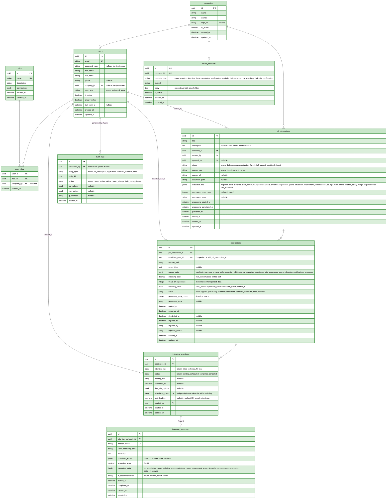

# Database Design - AI-Powered Recruitment Platform

> **Source of Truth**: This document is the authoritative reference for database schema, entities, relationships, constraints, indexes, JSONB schemas, and data lifecycle.
>
> For architectural decisions explaining *why* the schema is designed this way, see [SYSTEM_DESIGN.md](SYSTEM_DESIGN.md) §4 Key Design Decisions.

---

## Table of Contents

1. [Design Principles](#1-design-principles)
2. [Entity Reference](#2-entity-reference)
3. [Entity Relationship Diagram](#3-entity-relationship-diagram)
4. [Enum & Status Definitions](#4-enum--status-definitions)
5. [JSONB Schema Definitions](#5-jsonb-schema-definitions)
6. [Indexing Strategy](#6-indexing-strategy)
7. [Data Retention & Deletion](#7-data-retention--deletion)
8. [Migration Sequence](#8-migration-sequence)

---

## 1. Design Principles

1. **JSONB for AI-Extracted Data**: Both `extracted_data` (JD) and `matching_result` (application) use PostgreSQL JSONB - allows schema evolution without migrations and efficient querying with GIN indexes.

2. **Status-Driven Workflows**: State machines for JD lifecycle (`draft → processing → draft_parsed → published → closed`) and application lifecycle (`applied → processing → screened → shortlisted → interview_scheduled → hired/rejected`). All status transitions are validated at the application layer.

3. **Ghost User Support**: Candidates can apply without creating an account. A ghost user record (`user_type = ghost`) is created with no password or company. The application confirmation email includes an opt-in link to create a full account later.

4. **Multi-Tenancy**: Company-scoped data isolation. All queries for HR/admin users are automatically scoped to `company_id`.

5. **Denormalised Read Columns**: `matching_score` (float) and `years_of_experience` (integer) are stored as typed columns on `applications` for fast `ORDER BY` and `WHERE` without JSONB parsing.

---

## 2. Entity Reference

### Summary

| Entity | Purpose | Phase |
|--------|---------|-------|
| `companies` | Multi-tenant company records | MVP |
| `roles` | RBAC role definitions with permission sets | MVP |
| `users` | All user accounts (registered + ghost) | MVP |
| `user_roles` | Many-to-many user-role assignments | MVP |
| `job_descriptions` | Job postings with AI-extracted data | MVP |
| `applications` | Candidate applications with AI scoring | MVP |
| `interview_schedules` | Interview scheduling and slot management | MVP |
| `email_templates` | Company-configurable email templates | MVP (seeded) |
| `audit_logs` | Comprehensive audit trail | Future (minimal status logging in MVP) |
| `interview_screenings` | AI video screening session data | Phase 2 |

### companies

| Column | Type | Constraints | Description |
|--------|------|-------------|-------------|
| `id` | uuid | PK | |
| `name` | string | NOT NULL | Company display name |
| `domain` | string | NOT NULL | Company domain |
| `logo_url` | string | nullable | Company logo URL |
| `is_active` | boolean | NOT NULL, default true | Soft-delete flag |
| `created_at` | datetime | NOT NULL | |
| `updated_at` | datetime | NOT NULL | |

### roles

| Column | Type | Constraints | Description |
|--------|------|-------------|-------------|
| `id` | uuid | PK | |
| `name` | string | UK, NOT NULL | Role identifier (e.g., `super_admin`, `hr_manager`) |
| `description` | string | NOT NULL | Human-readable description |
| `permissions` | jsonb | NOT NULL | Permission set for this role |
| `created_at` | datetime | NOT NULL | |
| `updated_at` | datetime | NOT NULL | |

### users

| Column | Type | Constraints | Description |
|--------|------|-------------|-------------|
| `id` | uuid | PK | |
| `email` | string | UK, NOT NULL | |
| `password_hash` | string | nullable | Null for ghost users |
| `first_name` | string | NOT NULL | |
| `last_name` | string | NOT NULL | |
| `phone` | string | nullable | |
| `company_id` | uuid | FK → companies, nullable | Null for ghost users |
| `user_type` | string | NOT NULL | `registered` or `ghost` |
| `is_active` | boolean | NOT NULL, default true | |
| `email_verified` | boolean | NOT NULL, default false | |
| `last_login_at` | datetime | nullable | |
| `created_at` | datetime | NOT NULL | |
| `updated_at` | datetime | NOT NULL | |

### user_roles

| Column | Type | Constraints | Description |
|--------|------|-------------|-------------|
| `user_id` | uuid | FK → users, PK (composite) | |
| `role_id` | uuid | FK → roles, PK (composite) | |
| `assigned_by` | uuid | FK → users, nullable | Who assigned this role |
| `created_at` | datetime | NOT NULL | |

### job_descriptions

| Column | Type | Constraints | Description |
|--------|------|-------------|-------------|
| `id` | uuid | PK | |
| `title` | string | NOT NULL | Mandatory at creation time |
| `description` | text | nullable | Raw JD text entered from UI |
| `company_id` | uuid | FK → companies, NOT NULL | |
| `created_by` | uuid | FK → users, NOT NULL | |
| `updated_by` | uuid | FK → users, nullable | |
| `status` | string | NOT NULL | See [JD Status Enum](#jd-status) |
| `source_type` | string | NOT NULL | `link`, `document`, or `manual` |
| `source_url` | string | nullable | URL for `link` source type |
| `document_path` | string | nullable | S3 path for uploaded document |
| `extracted_data` | jsonb | nullable | See [JD extracted_data Schema](#jd-extracted_data) |
| `processing_retry_count` | integer | NOT NULL, default 0 | Max 3 retries |
| `processing_error` | string | nullable | Last error message |
| `processing_started_at` | datetime | nullable | |
| `processing_completed_at` | datetime | nullable | |
| `published_at` | datetime | nullable | When status changed to published |
| `closed_at` | datetime | nullable | When status changed to closed |
| `created_at` | datetime | NOT NULL | |
| `updated_at` | datetime | NOT NULL | |

**Publishing Gate**: Status can only transition to `published` if `title` and `extracted_data.required_skills` are populated.

### applications

| Column | Type | Constraints | Description |
|--------|------|-------------|-------------|
| `id` | uuid | PK | |
| `job_description_id` | uuid | FK → job_descriptions, NOT NULL | |
| `candidate_user_id` | uuid | FK → users, NOT NULL | Composite UK with `job_description_id` |
| `resume_path` | string | NOT NULL | S3 path for uploaded resume |
| `cover_letter` | text | nullable | |
| `parsed_data` | jsonb | nullable | See [Application parsed_data Schema](#application-parsed_data) |
| `matching_score` | decimal | nullable | 0-10, denormalised for fast sort |
| `years_of_experience` | integer | nullable | Denormalised from `parsed_data.total_experience_years` |
| `matching_result` | jsonb | nullable | See [Application matching_result Schema](#application-matching_result) |
| `status` | string | NOT NULL | See [Application Status Enum](#application-status) |
| `processing_retry_count` | integer | NOT NULL, default 0 | Max 3 retries |
| `processing_error` | string | nullable | |
| `applied_at` | datetime | NOT NULL | |
| `screened_at` | datetime | nullable | When AI scoring completed |
| `shortlisted_at` | datetime | nullable | |
| `rejected_at` | datetime | nullable | |
| `rejected_by` | string | nullable | |
| `rejection_reason` | string | nullable | |
| `created_at` | datetime | NOT NULL | |
| `updated_at` | datetime | NOT NULL | |

**Unique Constraint**: `(job_description_id, candidate_user_id)` - one application per candidate per JD.

### interview_schedules

| Column | Type | Constraints | Description |
|--------|------|-------------|-------------|
| `id` | uuid | PK | |
| `application_id` | uuid | FK → applications, NOT NULL | |
| `interview_type` | string | NOT NULL | `initial`, `technical`, `hr`, `final` |
| `status` | string | NOT NULL | See [Interview Status Enum](#interview-status) |
| `meeting_link` | string | nullable | For direct invite (Option A) |
| `scheduled_at` | datetime | nullable | Confirmed interview time |
| `time_slot_options` | jsonb | nullable | Array of slot options for self-scheduling |
| `scheduling_token` | string | UK | Unique single-use token for self-scheduling URL |
| `slot_deadline` | datetime | nullable | Default 48h deadline for self-scheduling |
| `created_by` | uuid | FK → users, NOT NULL | HR user who created the invite |
| `created_at` | datetime | NOT NULL | |
| `updated_at` | datetime | NOT NULL | |

### email_templates

| Column | Type | Constraints | Description |
|--------|------|-------------|-------------|
| `id` | uuid | PK | |
| `company_id` | uuid | FK → companies, NOT NULL | |
| `template_type` | string | NOT NULL | See [Email Template Type Enum](#email-template-type) |
| `subject` | string | NOT NULL | Subject line (supports `{{variable}}` placeholders) |
| `body` | text | NOT NULL | Email body (supports `{{variable}}` placeholders) |
| `is_active` | boolean | NOT NULL, default true | |
| `created_at` | datetime | NOT NULL | |
| `updated_at` | datetime | NOT NULL | |

### audit_logs (Future - minimal status logging in MVP)

| Column | Type | Constraints | Description |
|--------|------|-------------|-------------|
| `id` | uuid | PK | |
| `performed_by` | uuid | FK → users, nullable | Null for system actions |
| `entity_type` | string | NOT NULL | `job_description`, `application`, `interview_schedule`, `user` |
| `entity_id` | uuid | NOT NULL | |
| `action` | string | NOT NULL | `create`, `update`, `delete`, `status_change`, `bulk_status_change` |
| `old_values` | jsonb | nullable | Previous state |
| `new_values` | jsonb | nullable | New state |
| `ip_address` | string | nullable | |
| `created_at` | datetime | NOT NULL | |

### interview_screenings (Phase 2)

| Column | Type | Constraints | Description |
|--------|------|-------------|-------------|
| `id` | uuid | PK | |
| `interview_schedule_id` | uuid | FK → interview_schedules, NOT NULL | One-to-one |
| `session_token` | string | UK | Unique session identifier |
| `video_recording_path` | string | | S3 path for video recordings |
| `transcript` | text | | Full transcript |
| `questions_asked` | jsonb | | Array of {question, answer, score, analysis} |
| `screening_score` | decimal | | 0-100 |
| `evaluation_data` | jsonb | | communication_score, technical_score, confidence_score, etc. |
| `ai_recommendation` | string | | `proceed`, `reject`, `review` |
| `started_at` | datetime | | |
| `completed_at` | datetime | | |
| `created_at` | datetime | NOT NULL | |
| `updated_at` | datetime | NOT NULL | |


---

## 3. Entity Relationship Diagram



---

## 4. Enum & Status Definitions

### JD Status

| Status | Description | Transitions To |
|--------|-------------|---------------|
| `draft` | Created, no AI extraction yet | `processing` |
| `processing` | AI extraction in progress | `draft_parsed`, `extraction_failed` |
| `extraction_failed` | AI extraction failed after retries | Terminal (retry via reprocess) |
| `draft_parsed` | AI extraction complete, awaiting HR review | `published` |
| `published` | Visible on public job board | `closed`, `draft_parsed` (unpublish) |
| `closed` | No longer accepting applications | Terminal |

### Application Status

| Status | Description | Transitions To |
|--------|-------------|---------------|
| `applied` | Submitted, awaiting processing | `processing` |
| `processing` | AI extraction/matching in progress | `screened` |
| `screened` | AI scoring complete, awaiting HR review | `shortlisted`, `rejected` |
| `shortlisted` | HR marked as potential candidate | `interview_scheduled`, `rejected` |
| `interview_scheduled` | Interview has been scheduled | `hired`, `rejected` |
| `hired` | Candidate accepted | Terminal |
| `rejected` | Candidate rejected | Terminal |

### Interview Status

| Status | Description |
|--------|-------------|
| `pending` | Self-scheduling invite sent, awaiting candidate selection |
| `scheduled` | Time confirmed (direct invite or slot selected) |
| `completed` | Interview completed |
| `cancelled` | Interview cancelled |

### User Type

| Value | Description |
|-------|-------------|
| `registered` | Full account with password and company |
| `ghost` | Auto-created for guest applicants - no password, no company |

### Role Names

| Role | Scope | Description |
|------|-------|-------------|
| `super_admin` | All companies | Full system access |
| `company_admin` | Own company | Manage users, view all company data |
| `hr_manager` | Own company | Create/publish/close jobs, view all applicants, schedule interviews |
| `recruiter` | Own company | Create/publish jobs, view applicants for own jobs, schedule interviews |
| `candidate` | Own data | Browse jobs, submit applications, view own application status |

### Email Template Type

| Value | Description |
|-------|-------------|
| `rejection` | Candidate rejection notification |
| `interview_invite` | Interview invitation email |
| `application_confirmation` | Application received confirmation |
| `reminder_24h` | Interview reminder (24 hours before) - Future |
| `reminder_1h` | Interview reminder (1 hour before) - Future |
| `scheduling_link` | Self-scheduling link email |
| `slot_confirmation` | Slot selection confirmation email |

---

## 5. JSONB Schema Definitions

### JD `extracted_data`

```json
{
  "required_skills":           [ "Python", "PostgreSQL", "REST APIs" ],
  "preferred_skills":          [ "Kubernetes", "GraphQL" ],
  "minimum_experience_years":  3,
  "preferred_experience_years": 5,
  "education_requirements":    [ "Bachelor's in Computer Science or related" ],
  "certifications":            [],
  "job_type":                  "full-time",
  "work_mode":                 "hybrid",
  "location":                  "Mumbai, India",
  "salary_range":              { "min": 1200000, "max": 1800000, "currency": "INR" },
  "responsibilities":          [ "Design and maintain backend services", "..." ],
  "role_summary":              "..."
}
```

All fields return `null` if not explicitly found in the JD. The LLM prompt constrains: "Do not infer or hallucinate values."

### Application `parsed_data`

```json
{
  "candidate_summary":        "...",
  "primary_skills":           [ "Python", "FastAPI", "PostgreSQL" ],
  "secondary_skills":         [ "Docker", "Redis" ],
  "domain_expertise":         [ "FinTech", "e-commerce" ],
  "experience": [
    {
      "company":          "Acme Corp",
      "title":            "Backend Engineer",
      "start_date":       "2021-06",
      "end_date":         "2024-03",
      "duration_months":  33,
      "responsibilities": [ "..." ],
      "technologies":     [ "Python", "Django" ]
    }
  ],
  "total_experience_years":   4.5,
  "education": [
    {
      "degree":           "B.Tech",
      "field":            "Computer Science",
      "institution":      "IIT Bombay",
      "graduation_year":  "2019"
    }
  ],
  "certifications":           [ "AWS Certified Developer" ],
  "languages":                [ "English (fluent)", "Hindi (native)" ]
}
```

### Application `matching_result`

```json
{
  "skills_match": {
    "score":           0.85,
    "matched_skills":  [ "Python", "PostgreSQL", "REST APIs" ],
    "missing_skills":  [ "Kubernetes" ]
  },
  "experience_match": {
    "score":                  0.90,
    "years_required":         3,
    "years_candidate_has":    4.5
  },
  "education_match": {
    "score":                  1.0,
    "meets_requirements":     true
  },
  "overall_fit": {
    "score":           8.7,
    "recommendation":  "strong_fit",
    "strengths":       [ "Strong Python skills", "Exceeds experience requirement" ],
    "concerns":        [ "No Kubernetes experience" ],
    "summary":         "..."
  }
}
```

### Denormalised Columns on `applications`

| Column | Type | Source | Purpose |
|--------|------|--------|---------|
| `matching_score` | float (0-10) | `matching_result.overall_fit.score` | Fast `ORDER BY` sorting |
| `years_of_experience` | integer | `parsed_data.total_experience_years` | Fast filter/sort |

---

## 6. Indexing Strategy

| Table | Index | Columns | Type | Access Pattern | Required For |
|-------|-------|---------|------|----------------|-------------|
| `job_descriptions` | Status filter | `status` | B-tree | Filter by published/draft/closed | Public job browsing, HR dashboard |
| `job_descriptions` | Company isolation | `company_id` | B-tree | Multi-tenant queries | All JD queries |
| `applications` | Applications by JD | `job_description_id` | B-tree | All applicants for a job | Applicant list |
| `applications` | Score ranking | `matching_score DESC` | B-tree | Sort candidates by score | Ranked applicant list |
| `applications` | Status filter | `status` | B-tree | Filter by screened/shortlisted/etc | HR dashboard filters |
| `applications` | Combined HR query | `(job_description_id, status, matching_score DESC)` | Composite B-tree | Single-query HR dashboard with filter + sort | Applicant list performance |
| `applications` | Duplicate check | `(job_description_id, candidate_user_id)` | Composite B-tree UK | Enforce one application per user per JD | Application submission |
| `applications` | Experience filter | `years_of_experience` | B-tree | Filter candidates by experience range | HR dashboard filters |
| `job_descriptions` | AI data search | `extracted_data` | GIN | Query inside JSONB | AI pipeline, search |
| `applications` | Resume data search | `parsed_data` | GIN | Query inside JSONB | AI pipeline, search |
| `interview_schedules` | Token lookup | `scheduling_token` | B-tree UK | Token-based self-scheduling URL | Self-scheduling flow |
| `email_templates` | Template lookup | `(company_id, template_type)` | Composite B-tree | Fetch company-specific templates | Email sending |

### Query Patterns to Avoid

- **N+1 queries** - always eager-load associated records in a single query
- **Full table scans on large tables** - all `WHERE` clauses on `applications` and `job_descriptions` must use indexed columns
- **Sorting unindexed JSONB fields** - sort on the denormalised `matching_score` float column, not on `extracted_data->>'score'`
- **Unbounded queries** - all list endpoints must enforce a `LIMIT` and use cursor or offset pagination

---

## 7. Data Retention & Deletion

### Retention Policy

| Record Type | Retention Period |
|-------------|-----------------|
| Rejected applications | 180 days |
| Hired candidate records | 7 years |
| Withdrawn applications | 30 days |
| Closed job descriptions | 5 years |
| Screening interview recordings (Phase 2) | 2 years (or until deletion requested) |

### Right to Erasure (GDPR Article 17)

When a deletion request is received for a candidate:
1. All application records for that email are deleted from the database
2. All uploaded files (resumes) are deleted from object storage
3. A deletion confirmation record is retained (no personal data - only timestamp and hash of email)

The deletion process is triggered via an authenticated API endpoint restricted to admin roles.

---

## 8. Migration Sequence

### MVP (Phase 1A)

1. `companies` - base tenant table
2. `roles` - RBAC role definitions
3. `users` - all user accounts
4. `user_roles` - role assignments
5. `job_descriptions` - JD records with AI extraction
6. `applications` - candidate applications with AI scoring
7. `email_templates` - seeded with default templates
8. `interview_schedules` - interview management

### Post-MVP

9. `audit_logs` - comprehensive audit trail (minimal status logging before this)

### Phase 2

10. `interview_screenings` - AI video screening data


