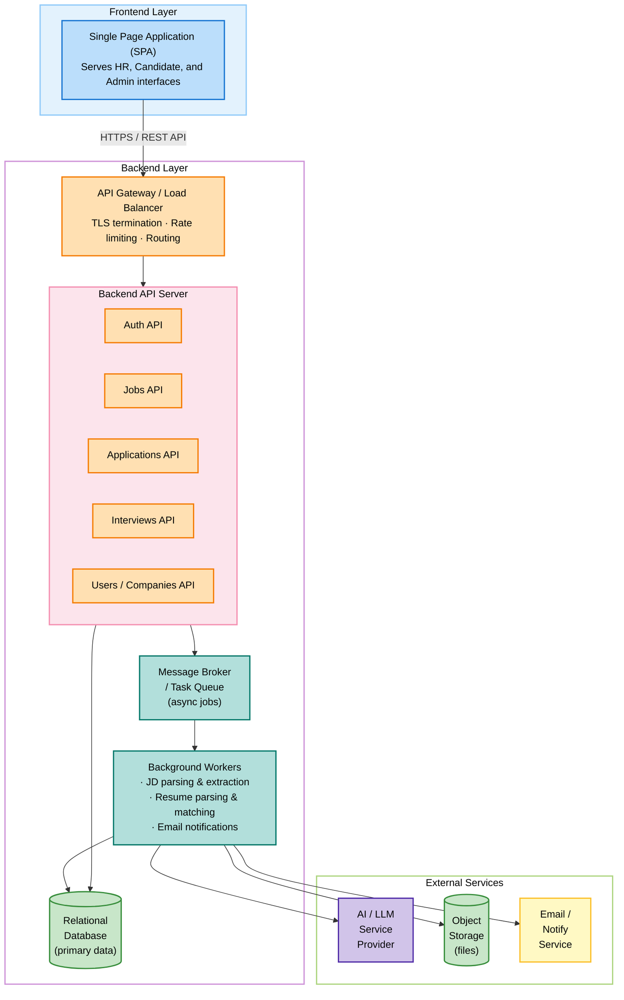
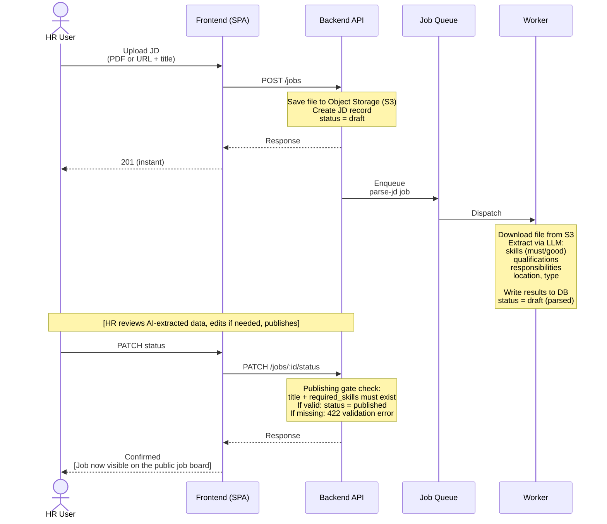
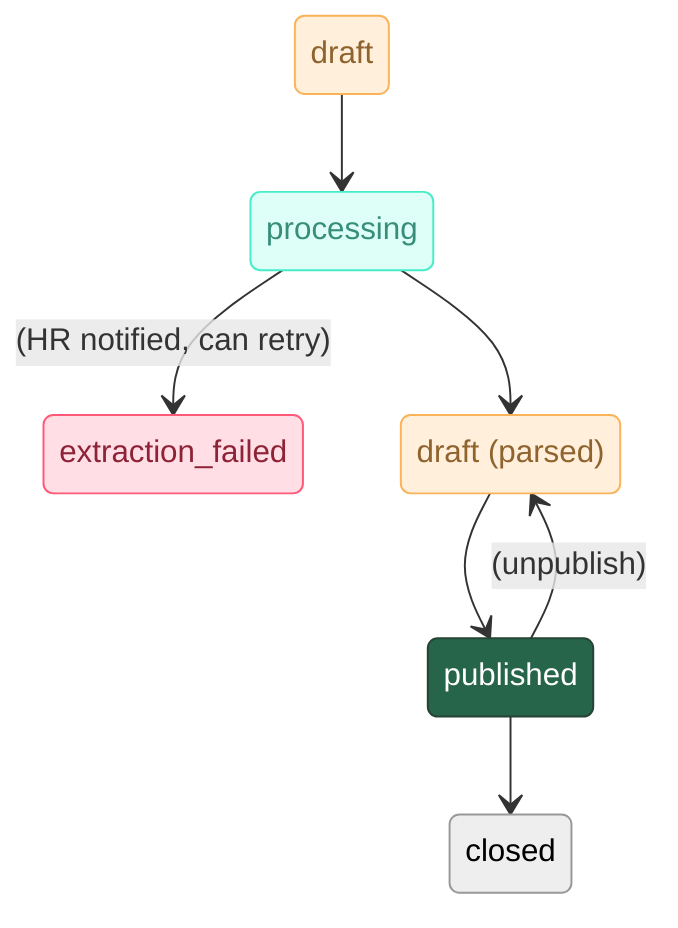
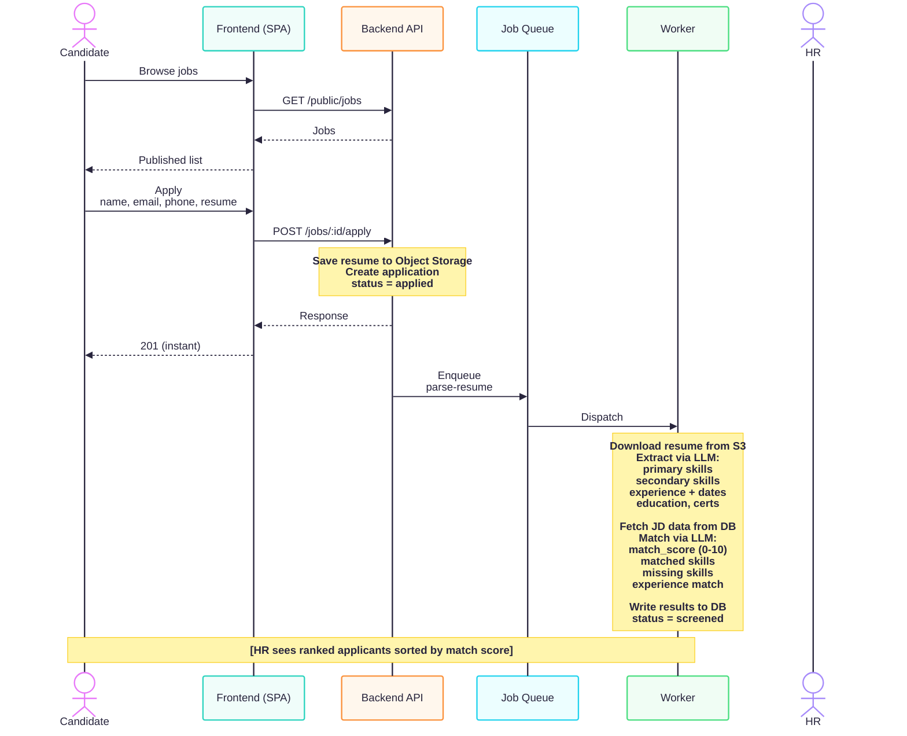
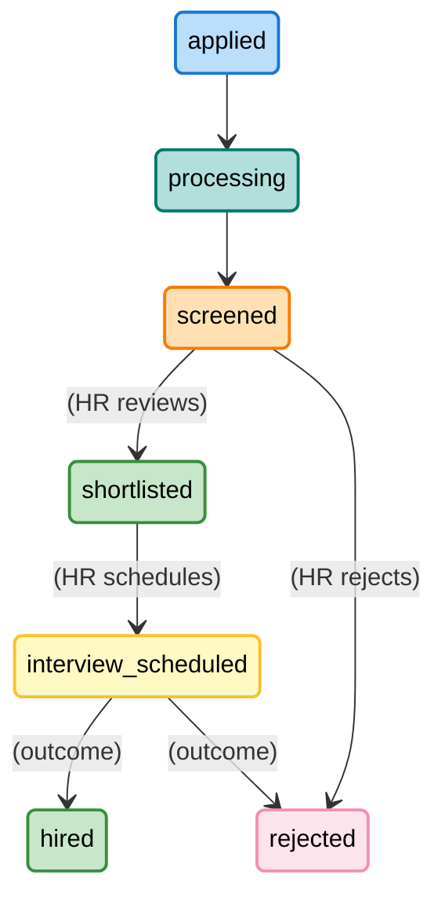
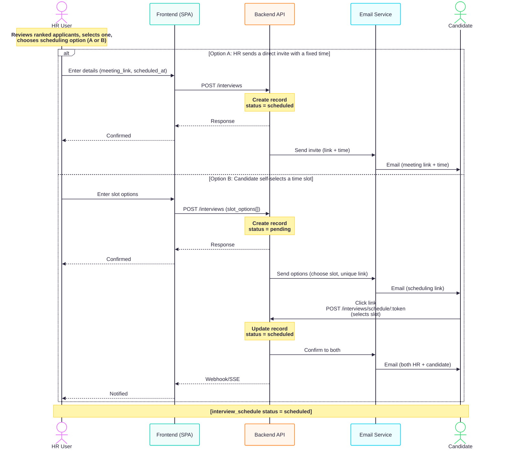
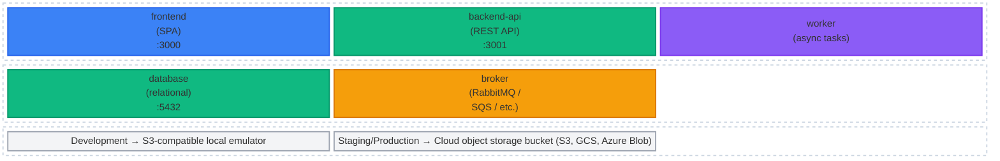
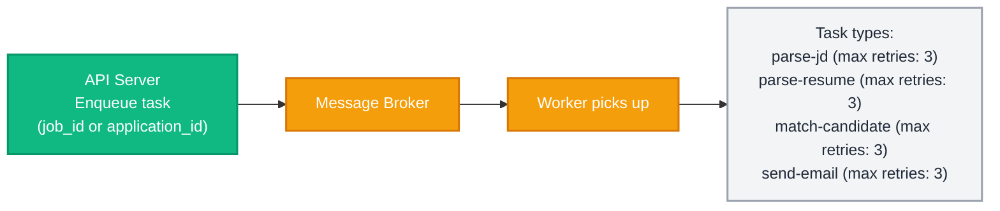

# AI-Powered Recruitment Screening Platform - System Design

## Table of Contents
1. [Overview](#1-overview)
2. [System Architecture](#2-system-architecture)
3. [Technology Stack](#3-technology-stack)
4. [Database Design](#4-database-design)
5. [API Design](#5-api-design)
6. [Authentication & Authorization](#6-authentication--authorization)
7. [Core Features & Workflows](#7-core-features--workflows)
8. [AI Processing Pipeline](#8-ai-processing-pipeline)
9. [Infrastructure & Deployment](#9-infrastructure--deployment)
10. [Security Considerations](#10-security-considerations)
11. [Scalability & Performance](#11-scalability--performance)

13. [Testing Strategy](#13-testing-strategy)

15. [Future Scope](#15-future-scope)
16. [Conclusion](#16-conclusion)

---

## 1. Overview

### Purpose
An AI-powered recruitment platform that automates the candidate screening process by:
- Parsing job descriptions and extracting key requirements
- Processing candidate resumes and extracting qualifications
- Automatically ranking candidates based on JD-resume matching
- Facilitating interview scheduling for top candidates

### Key Stakeholders
- **HR/Recruiters**: Publish jobs, review candidates, schedule interviews
- **Admins**: System-wide access and management
- **Candidates**: Browse jobs, apply, schedule interviews (optional account)

### Core Value Proposition
Eliminate manual screening overhead with AI-driven candidate ranking and matching.

---

## 2. System Architecture

### High-Level Architecture



### Architecture Patterns

| Pattern | Applied to |
|---------|-----------|
| **Modular monolith** | Backend - single codebase with clear module boundaries; extract services when needed |
| **Event-driven async** | All AI processing via background workers |
| **RESTful API** | All client-server communication |
| **Denormalised read columns** | `matching_score` and `years_of_experience` on applications table for fast sorting without JSONB parsing |
| **Repository pattern** | Data access layer - decouples business logic from DB |
| **Status-machine driven** | JD lifecycle and application lifecycle |

---

## 3. Technology Stack

The following technologies have been selected for the platform to balance rapid MVP development with long-term scalability.

---

### Frontend

| Component | Selection | Alternative Options Considered | Rationale |
|-----------|-----------|--------------------------------|-----------|
| Framework | React (JavaScript) | Vue, Angular, Svelte | Team familiarity, rich ecosystem, SPA model fits this product |
| UI Library | Modern React Library + TailwindCSS | Material UI, Ant Design, Chakra UI, shadcn/ui | Rapid styling and responsive design |
| File Upload | Pre-signed S3 URLs via frontend | - | Bypasses backend server to save bandwidth |
| Other Tooling | Vite, Axios, React Router, Vitest | Next.js, Redux, Playwright, Cypress | Standard React ecosystem defaults |

---

### Backend

The backend handles REST APIs, authentication, job orchestration, async task dispatch, and AI processing logic. Python is chosen because the AI/ML ecosystem is strongest in Python.

| Component | Selection | Alternative Options Considered | Rationale |
|-----------|-----------|--------------------------------|-----------|
| Framework | FastAPI (Python) | Django REST Framework, Flask, Litestar | Async-native, auto-generated OpenAPI, strong LLM SDK support |
| Schema Validation | Pydantic | Marshmallow, cerberus | Aligns perfectly with FastAPI and JSONB schemas |
| API Documentation | Auto-generated via FastAPI | drf-spectacular, Swagger | Zero-maintenance Swagger UI |
| Email Service | SendGrid or Resend | - | Simple API, generous free tier for MVP volumes |
| Data Access | SQLAlchemy (TBD) | Django ORM, Tortoise ORM, Peewee | Standard for FastAPI |
| Auth & Crypto | python-jose, passlib (bcrypt) | authlib, argon2-cffi | Proven security |

---

### AI Processing

AI processing runs as a module within the backend codebase. All AI tasks are executed by background workers to ensure long-running LLM calls never block API responses.

| Component | Selection | Alternative Options Considered | Rationale |
|-----------|-----------|--------------------------------|-----------|
| LLM Provider | OpenAI (GPT-4o) | Anthropic Claude, Google Gemini, Mistral | Primary provider for the strongest structured JSON output |
| Local LLM | Ollama | - | Option for local development to avoid API costs |
| Document Parsing | pdfplumber / python-docx | PyMuPDF, PyPDF2 | Python-native text extraction |
| Orchestration | Custom prompt pipeline / LangChain | LlamaIndex | Simple is better for MVP |
| Audio (Phase 2) | OpenAI Whisper, NeMo MSDD | Google STT, AWS Transcribe, pyannote | Documented for future phase |

---

### Async Processing

All AI tasks run asynchronously. The API server enqueues a job; a worker picks it up and processes it in the background, then writes results directly to the database.

| Component | Selection | Alternative Options Considered | Rationale |
|-----------|-----------|--------------------------------|-----------|
| Message Broker | Redis | RabbitMQ, AWS SQS, Google Pub/Sub | Serves as both broker and result backend |
| Task Queue | Celery / Dramatiq / ARQ | Huey | Redis-backed; final framework chosen during setup |
| Scheduling | Celery Beat / APScheduler | cloud-native schedulers | Standard Python scheduling |

---

### Data Layer

| Component | Selection | Alternative Options Considered | Rationale |
|-----------|-----------|--------------------------------|-----------|
| Primary Database | PostgreSQL | MySQL, CockroachDB | JSONB support required for AI-extracted data, proven reliability |
| Object Storage | S3-compatible | Google Cloud Storage, Azure Blob Storage | S3 API is the standard. MinIO simplifies Docker-based local dev |

> **Storage note**: Object storage is the single source of truth for all uploaded files (JDs and resumes). A local MinIO container is used during development. In production, a managed S3-compatible service is used directly.

---

### Infrastructure

| Component | Selection | Alternative Options Considered | Rationale |
|-----------|-----------|--------------------------------|-----------|
| Containerisation | Docker | - | Mandatory per architecture - same images across all environments |
| Repository | Monorepo | - | Simplifies coordination during early development |
| Orchestration | AWS ECS / Cloud Run (TBD) | Kubernetes, Docker Swarm | To be decided at deployment |
| API Gateway | Nginx / Caddy | Traefik, Kong, AWS API Gateway | Standard reverse proxy |
| Cloud & Secrets | AWS / AWS Secrets Manager (TBD) | GCP, Azure, HashiCorp Vault | Depends on chosen cloud provider |

### Key Constraints That Drive Choices

The following requirements constrain the option space regardless of preference:

1. **JSONB support** - the database must support a flexible JSON column type. This rules out MySQL before version 5.7 and most NoSQL databases as a primary store.
2. **S3-compatible object storage in production** - all environments above local dev must use a cloud-managed object storage service. Local emulators are not permitted in staging or production.
3. **Async worker separate from the API process** - AI tasks are long-running (10-120 seconds). They must not block the API server. The task queue and worker are mandatory architectural components, not optional.
4. **AI processing isolation via task queue** - all LLM-calling code runs in background worker processes, not in the API request/response cycle. Workers are separate OS processes running the same codebase with a different entrypoint. This prevents LLM latency from degrading API response times and allows workers to be scaled independently based on queue depth.
5. **Containerisation is mandatory** - every component ships as a Docker image. This applies to all environments including development, so environment parity is maintained from day one.

---

## 4. Database Design

> **Full Reference**: Entity definitions, column details, ER diagram, JSONB schemas, indexing strategy, data retention, and migration sequence are documented in [DB_DESIGN.md](DB_DESIGN.md).

### Entity Summary

| Entity | Purpose | Phase |
|--------|---------|-------|
| `companies` | Multi-tenant company records | MVP |
| `roles` | RBAC role definitions with `permissions` JSONB | MVP |
| `users` | All user accounts - registered and ghost (candidates without accounts) | MVP |
| `user_roles` | Many-to-many user-role assignments | MVP |
| `job_descriptions` | JD records with `extracted_data` JSONB for AI-extracted requirements | MVP |
| `applications` | Candidate applications with `parsed_data`, `matching_result` JSONB, denormalised `matching_score` and `years_of_experience` | MVP |
| `interview_schedules` | Interview scheduling with direct invite and self-scheduling support | MVP |
| `email_templates` | Company-configurable email templates with `{{variable}}` placeholders | MVP (seeded) |
| `audit_logs` | Comprehensive audit trail (minimal status logging in MVP, full schema in Future) | Future |


### Key Design Decisions

1. **JSONB for Flexible Schemas**: Both `extracted_data` and `matching_result` use PostgreSQL's JSONB type
   - Allows schema evolution without migrations
   - Enables efficient querying with GIN indexes
   - Perfect for AI-extracted unstructured data

2. **Status-Driven Workflows**: State machines for job descriptions and applications
   - Clear lifecycle tracking
   - Enables conditional business logic

3. **Ghost User Support**: Candidates can apply without creating an account (FR-201)
   - A "ghost" user record is created in the `users` table with `user_type = ghost`
   - The application record points to this ghost user via `candidate_user_id` (not null)
   - If the candidate's email matches an existing user, the application is linked automatically
   - The ghost user does not have a password or company association
   - GDPR-compliant: no full account is created without explicit consent, but data is normalized
   - The application confirmation email includes an opt-in link allowing the ghost user to create a full account later

4. **JD Creation Modes**: Three source types for job descriptions
   - `document`: HR requests a pre-signed upload URL, uploads the PDF/DOCX to S3, and submits the form with the `document_key`. AI extraction runs automatically in the background.
   - `link`: HR provides a URL → system fetches and stores the page content server-side as plain text before AI extraction runs
   - `manual`: HR creates the JD directly from the UI by filling in the form fields (title + description text) - no AI extraction needed. HR can populate `extracted_data` fields manually and publish when ready (AC-002)

5. **Separate Interview Scheduling**: Dedicated table for interview management
   - Supports multiple interview rounds
   - Flexible scheduling (HR-sent link or candidate self-selection)
   - `slot_deadline` enforces the 48-hour deadline for self-scheduling (FR-402)

6. **Configurable Email Templates**: Company-level `email_templates` table
   - Supports rejection, invitation, confirmation, and reminder email types
   - Templates use variable placeholders (e.g. `{{candidate_name}}`, `{{job_title}}`)
   - Enables FR-304 (configurable rejection email) and FR-403 (notification customisation)

---

## 5. API Design

> **Full Reference**: Endpoint contracts, request/response schemas, role access per endpoint, query parameters, error format, and phase classification are documented in [API_SPEC.md](API_SPEC.md).

### API Design Principles

- **RESTful**: All endpoints follow REST conventions with resource-based URLs
- **Versioned**: All routes prefixed with `/api/v1/`
- **RBAC-Protected**: Role-based access control on all authenticated endpoints
- **Idempotent**: Resource creation endpoints support `Idempotency-Key` header
- **No `/admin/` namespace**: Administrative operations use standard resource URLs (`/users`, `/companies`, `/roles`) with RBAC determining scope

### API Groups

| Group | Base Path | Auth | Key Endpoints | Phase |
|-------|-----------|------|---------------|-------|
| Authentication | `/api/v1/auth/` | Public | register, login, refresh, logout, forgot-password, reset-password, me | MVP |
| Job Descriptions | `/api/v1/jobs/` | JWT | CRUD, status change, applicant list | MVP |
| Public Browsing | `/api/v1/public/jobs/` | None | Browse jobs, view job, apply | MVP |
| Applications | `/api/v1/applications/` | JWT | List, detail (with signed resume URL), status change | MVP |
| Interview Scheduling | `/api/v1/interviews/` | JWT / Token | Create invite, self-scheduling via token | MVP |
| User & Company Mgmt | `/api/v1/users/`, `/companies/`, `/roles/` | JWT (RBAC) | CRUD for users, companies, roles | Post-MVP |
| System | `/api/v1/system/` | JWT (super_admin) | Health check | MVP |

### Key Query Capabilities (Applicant List)

The applicant list endpoint (`GET /jobs/{id}/applicants`) supports:
- **Sort**: by score (default), date, name, experience
- **Filter**: by status, score range, experience range
- **Pagination**: max 50 per page

---

## 6. Authentication & Authorization

### Authentication Strategy

**Two-tier Authentication**:
1. **Guest Access**: Candidates can browse and apply without accounts
2. **JWT Authentication**: For registered users (HR, Admin, optional Candidates)

### JWT Implementation

Tokens are stateless JWTs signed with a secret key. Two token types are used:

| Token | Stored in | TTL | Purpose |
|-------|----------|-----|---------|
| Access token | Memory (not localStorage) | 15-30 minutes | Authenticates API requests |
| Refresh token | httpOnly cookie | 7 days | Issues new access tokens silently |

**Access token payload**:

| Claim | Description |
|-------|-------------|
| `sub` | User UUID |
| `email` | User email address |
| `roles` | Array of role names for this user |
| `company_id` | Company UUID - enforces tenant isolation |
| `iat` | Issued at timestamp |
| `exp` | Expiry timestamp |

**Token refresh flow**: When an API call returns 401, the client silently sends the refresh token to `POST /auth/refresh`. If valid, a new access token is returned and the original request is retried. If invalid or expired, the session is cleared and the user is sent to login.

**Token invalidation**: On logout, the refresh token is revoked server-side. The revoked token's JTI is stored in a revocation table in the database with an expiry timestamp matching the token's remaining lifetime. A background task periodically cleans up expired entries.

### Authorization - Role-Based Access Control (RBAC)

#### Roles & Permissions

| Role | Scope | Key permissions |
|------|-------|----------------|
| `super_admin` | All companies | Full system access - manage companies, users, roles, system config |
| `company_admin` | Own company | Manage users within company, view all company data |
| `hr_manager` | Own company | Create/publish/close jobs, view all applicants, schedule interviews |
| `recruiter` | Own company | Create/publish jobs, view applicants for own jobs, schedule interviews |
| `candidate` | Own data | Browse published jobs, submit applications, view own application status |

Guest (unauthenticated) access is permitted only on:
- `GET /api/v1/public/jobs` - browse published jobs
- `GET /api/v1/public/jobs/:id` - view job detail
- `POST /api/v1/public/jobs/:id/apply` - submit application

All other endpoints require a valid access token.

#### Permission Enforcement

Permissions are checked at two layers:

1. **Route layer** - middleware validates the token and extracts roles before the request reaches any handler. Requests with missing or invalid tokens are rejected with 401 before any business logic runs.

2. **Resource layer** - handlers verify the authenticated user's company matches the resource's company. An HR user from Company A cannot access jobs or applicants from Company B even with a valid token. This is enforced by automatically scoping all database queries to the authenticated user's `company_id`.

For user and company management endpoints, the same RBAC middleware determines scope: `super_admin` sees all companies and users; `company_admin` sees only users within their own company. The URL structure reflects the resources (`/users`, `/companies`), and the authorization layer determines what the caller can see and do.

---

## 7. Core Features & Workflows

---

### Workflow 1: Job Description Publishing



**JD status flow**:


> **Note**: `published → draft` (unpublish) is a valid reverse transition. `extraction_failed` is a terminal failure state that allows HR to retry via `POST /jobs/:id/reprocess` or edit fields manually.

> **Publishing Gate**: A JD can only transition to `published` if both `title` and `required_skills` (in `extracted_data`) are populated - either by AI extraction or manual entry. If either is missing, the API returns a 422 validation error explaining what is required (AC-003).

### Workflow 2: Candidate Application & AI Screening



**Application status flow**:


### Workflow 3: Interview Scheduling



---

## 8. AI Processing Pipeline

> **Full Reference**: Pipeline diagrams, prompt engineering tables, extraction schemas, matching score formula, document parsing flow, and task chaining details are documented in [AI_PROCESSING.md](AI_PROCESSING.md).

### Overview

Two AI pipelines power Phase 1. Both follow the same pattern: **API enqueues task → broker delivers → worker processes → worker writes results to DB**.

| Pipeline | Trigger | Input | Output | Status Change |
|----------|---------|-------|--------|---------------|
| **Pipeline A: JD Parsing** | HR uploads JD (via pre-signed URL) | Raw document text (PDF/DOCX) | `extracted_data` JSONB (12 fields: skills, experience, education, etc.) | `draft` → `processing` → `draft_parsed` |
| **Pipeline B: Resume Parsing + Matching** | Candidate applies (via pre-signed URL) | Resume text + JD extracted data | `parsed_data` JSONB (9 fields) + `matching_result` JSONB + `matching_score` (0-10) | `applied` → `processing` → `screened` |

### Matching Score Formula

```
matching_score = (skills × 0.40 + experience × 0.35 + education × 0.25) × 10
```

Each dimension is scored 0.0-1.0 by the LLM. If a dimension cannot be evaluated, it scores 0. The final score (0-10) is denormalised on the `applications` table for fast sorting.

### Key Design Constraints

- All prompts return **valid JSON** - output is stored directly as JSONB
- `null` is returned for any field not explicitly found - no hallucination
- Matching score is **advisory only** - HR must review and confirm every status transition (human-in-the-loop)
- `parse-resume` and `match-candidate` tasks are **chained** - matching runs automatically after resume parsing completes
- Document parsing supports PDF and DOCX via MIME type + magic byte validation

---

## 9. Infrastructure & Deployment

### Containerisation Strategy

Every component ships as a Docker image from local development through to production, keeping environments consistent.



> **Note**: `backend-api` and `worker` share the same codebase and Docker image. Only the startup command differs (`start-api` vs `start-worker`). All environments use the same S3-compatible API surface for object storage.

### Service Container Responsibilities

| Container | Responsibility |
|-----------|---------------|
| `frontend` | Serves the SPA - candidate, HR, and admin views |
| `backend-api` | REST API - auth, jobs, applications, interviews, user management |
| `worker` | Background task processor - JD parsing, resume extraction, matching, email notifications. Runs the same codebase as `backend-api` with a different entrypoint. Has direct database access. |
| `database` | Primary relational data store |
| `broker` | Message broker - carries tasks from `backend-api` to `worker` |

In production, the Docker images are deployed via an orchestration platform (Kubernetes, ECS, or similar). The same images are used - only the configuration around them changes. All services are designed to be stateless and horizontally scalable.

### Environment Configuration

All configuration is environment-driven. Sensitive values are injected at runtime via a secrets manager - never stored in source control.

| Category | Key Variables |
|----------|-------------|
| Application | `APP_ENV`, `LOG_LEVEL` |
| Database | `DATABASE_URL`, `DB_POOL_SIZE` |
| Message broker | `BROKER_URL` |
| Authentication | `JWT_SECRET`, `JWT_ACCESS_TTL`, `JWT_REFRESH_TTL` |
| Object storage | `STORAGE_PROVIDER`, `STORAGE_BUCKET`, `STORAGE_REGION`, `STORAGE_ACCESS_KEY`, `STORAGE_SECRET_KEY`, `STORAGE_ENDPOINT` (dev only) |
| AI | `LLM_PROVIDER`, `LLM_API_KEY`, `LLM_MODEL` |
| Email | `EMAIL_PROVIDER`, `EMAIL_FROM`, `EMAIL_API_KEY` |
| Networking | `CORS_ORIGINS` |

Each service reads only its own environment variables. Sensitive values are never hardcoded in Dockerfiles or compose files.

---

## 10. Security Considerations

### Data Protection

1. **Encryption at Rest**
   - Database: PostgreSQL with encryption enabled
   - File Storage: S3 with server-side encryption (SSE-S3 or SSE-KMS)

3. **Signed URLs for File Access**
   - All file downloads (resumes, JD documents) are served via pre-signed URLs generated by the backend
   - Pre-signed URLs have a short TTL (15 minutes) and are generated on-demand when an authorized user requests a download
   - Files are never directly accessible from object storage - the bucket remains private
   - The frontend receives a signed URL from the API and uses it to download or display the file

2. **Encryption in Transit**
   - TLS 1.3 for all API communications
   - HTTPS enforced (redirect HTTP → HTTPS)

3. **Password Security**
   - Bcrypt hashing (cost factor: 12)
   - Password requirements: min 8 chars, uppercase, lowercase, number, special char
   - Password reset tokens: single-use, 1-hour expiry

### Data Retention & Privacy

> Data retention periods and GDPR right-to-erasure implementation details are documented in [DB_DESIGN.md](DB_DESIGN.md) §7.

**Key principle**: When a candidate requests deletion (GDPR Article 17), all application records and uploaded files are deleted. Only a deletion confirmation record (timestamp + email hash, no personal data) is retained.

### API Security

#### Rate Limiting

Every public-facing endpoint must have rate limiting applied. This can be enforced at the API gateway, application middleware, or via a sliding window counter.

Key limits to enforce:

| Endpoint group | Limit |
|---------------|-------|
| Public job application | 5 per hour per IP per JD |
| Auth login | 10 per 15 min per IP |
| AI-intensive endpoints | 20 per minute per authenticated user |
| General API | 300 per minute per authenticated user |

#### Input Validation

All incoming data must be validated at the API boundary before any business logic runs:

- Request body schema validated using the framework's validation layer (schema types, required fields, value ranges)
- All database queries use parameterised statements via the ORM - no raw string interpolation

#### File Validation (Worker-Side)

Because files are uploaded directly to object storage via pre-signed URLs, the backend API cannot validate the file stream synchronously. Validation occurs when the background worker downloads the file for processing:
- File uploads are validated by MIME type **and** magic byte signature - not extension alone
- All uploaded files are scanned for malware before AI processing. Infected or invalid files fail the task (status `extraction_failed`), and the file is deleted from object storage.
- File size is restricted at the bucket/pre-signed URL level (max 10MB).

#### CORS

The allowed origins list is strict and environment-specific:

- `development` - `localhost` origins only
- `staging` - staging domain only
- `production` - production domain only

Credentials (cookies) are only allowed on routes that require them. The wildcard origin `*` is never used.

---

## 11. Scalability & Performance

### Database Optimization

#### Indexing Strategy

> Detailed indexing strategy, access patterns, and query patterns to avoid are documented in [DB_DESIGN.md](DB_DESIGN.md) §6.

#### Connection Pooling

The application layer maintains a pool of persistent database connections rather than opening a new connection per request. Default pool size is 20 with burst headroom of 10 overflow connections. Connection pre-ping is enabled to detect stale connections before use.

---

### Async Task Queue

All AI processing tasks are handled asynchronously. The API never waits for an AI result synchronously.



**Task reliability requirements**:

| Requirement | Implementation |
|-------------|---------------|
| At-least-once delivery | Message broker acknowledgement - task stays in queue until worker acks |
| Retry on failure | Exponential backoff: 60s → 120s → 240s |
| Dead letter queue | Tasks that exhaust retries move to DLQ for manual inspection |
| Task timeout | Hard 5-minute ceiling per task - prevents runaway AI calls |
| Idempotency | Tasks check current record status before processing - safe to re-run |
| Observability | Task start, completion, and failure all written to application logs |

**Task chaining**: The `parse-resume` and `match-candidate` tasks are chained - when `parse-resume` completes successfully, it automatically enqueues the `match-candidate` task for the same application. The `match-candidate` task fetches the JD's `extracted_data` from the database, runs the LLM matching, writes the results (`matching_result`, `matching_score`, `years_of_experience`), and updates the application status to `screened`.


## 13. Testing Strategy

### Backend Testing

**Unit tests** cover: AI scoring formula, status machine transitions, document parser routing, permission checks, input validation.

**Integration tests** cover: Full job creation → AI processing → status update flow (with mocked AI), application → scoring → ranking flow, authentication flows (login, refresh, logout, expired token), endpoint access control (public vs protected, role enforcement).

**Test data**: Fixtures provide standard entities (a company, one user per role, published JDs, applications in each status). AI service and object storage are mocked - no real external API calls. Database uses a dedicated test instance reset between test runs.

### Frontend Testing

**Unit tests** cover: Form validation logic, state management, utility functions (score formatting, date display, status labels).

**Component tests** cover: File upload (drag-and-drop, type rejection, size error), score display, status badge colours, protected route redirects.

**E2E tests** cover three critical user journeys: HR publishes a job, candidate applies, HR reviews applicants.

### AI Pipeline Testing

| Test type | What it verifies | AI service used |
|-----------|-----------------|----------------|
| Schema validation tests | LLM output matches expected JSON schema | Mocked - fixed response |
| Scoring unit tests | Score calculation formula is correct | No LLM needed |
| Parser unit tests | PDF and DOCX text extraction is correct | No LLM needed |
| Integration smoke tests | Full pipeline runs end-to-end without error | Real API (CI only, not every run) |
| Regression fixtures | Known JD + resume pair produces score within expected range | Real API (weekly scheduled run) |


## 15. Future Scope

### Architecture & Infrastructure

- **OAuth2 SSO**: Google and LinkedIn SSO integration for streamlined user onboarding. Would be added as a third authentication tier alongside guest access and JWT.
- **Caching Strategy**: Application-level caching (e.g. Redis) for published job listings, company config, and applicant counts. Justified when read traffic on public endpoints warrants the added infrastructure. The application should be designed so caching can be introduced without structural changes.
- **Comprehensive Audit Logging**: The MVP implements minimal status change logging (recording who changed what status and when). The full `audit_logs` table schema is defined in the database design and can be activated when compliance requirements demand it. The full implementation would track all status changes, CRUD operations, admin actions, and provide a queryable audit trail with `old_values`/`new_values` JSONB fields.
- **Auto-scaling & Performance Monitoring**: Horizontal scaling policies based on observed metrics (CPU, queue depth, request rate). Monitoring infrastructure (Prometheus/Grafana, Datadog, etc.) with alerting thresholds. Relevant when production traffic patterns are established.
- **WebSocket Real-time Updates**: Replace frontend polling with persistent WebSocket connections for live status updates on AI processing results. Polling is sufficient for Phase 1 volumes.

### Scheduling & Notifications

- **Self-Scheduling Slot Constraints**: Limit HR to providing 2-5 time slot options for candidate self-scheduling (FR-402). Currently unconstrained.
- **Scheduling Deadline Notifications**: Notify HR when a self-scheduling deadline passes without candidate selection (FR-402).
- **Advanced Notification Types**: Reminder emails (24 hours before, 1 hour before interview), escalation notifications, and digest notifications. Currently only immediate notifications (invite, confirmation) are implemented.
- **Calendar Invite Attachments**: .ics calendar invite file attached to interview invitation emails.
- **Bulk Actions**: Select multiple applicants from the list and apply bulk shortlist/reject with configurable rejection email template (FR-304).
- **URL-Based JD Import**: JD creation via URL (`link` source_type) - system fetches, stores, and processes the page content. Document upload and manual entry are supported in MVP.

### Product Enhancements

- **Analytics Dashboard**: Hiring metrics and insights - time-to-hire, pipeline conversion rates, source effectiveness. The `GET /jobs/{id}/analytics` endpoint is defined but deferred.
- **Multi-language Support**: i18n for global reach
- **Assessment Integration**: Coding tests, personality assessments integrated into the screening pipeline
- **ATS Integration**: Sync with existing Applicant Tracking Systems
- **Mobile App**: React Native for iOS/Android

---

## 16. Conclusion

This document describes the architecture for an AI-powered recruitment screening platform.

**What this design gives you**:

- A technology-agnostic architecture where each component can be filled by the most appropriate option from the choices in Section 3
- A modular monolith backend where AI processing logic, API handlers, and business logic live in a single codebase with clear module boundaries - simplifying development, deployment, and debugging
- A proven async pattern (API → queue → worker → DB) that handles AI workloads without blocking user-facing requests
- Background workers that run the same codebase as the API server with a different entrypoint, enabling independent scaling via the task queue without the overhead of a separate service
- A fully containerised setup that uses the same Docker images across environments
- An extensible data model using JSONB for AI-extracted data, which evolves without schema migrations

**The single most important architectural decision** is keeping AI processing asynchronous via the task queue pattern. This means LLM latency never affects API response times, AI models can be swapped or upgraded without touching the API layer, and worker processes can be scaled independently based on queue depth - all without the operational overhead of a separate service.
