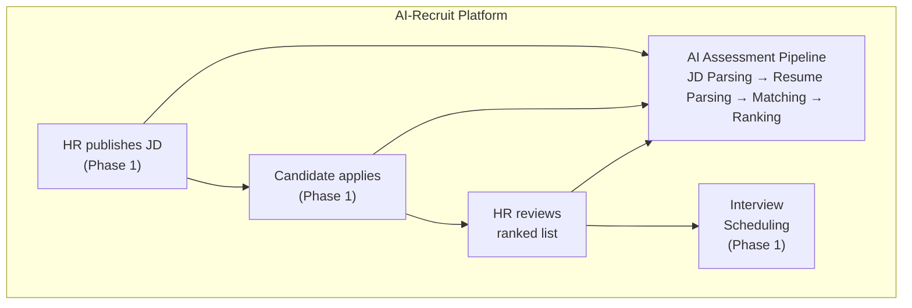
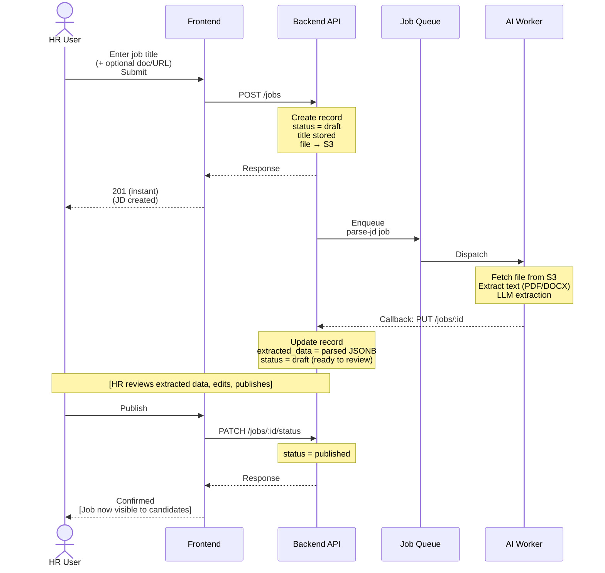
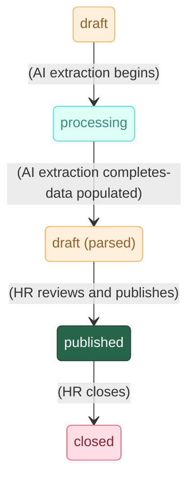
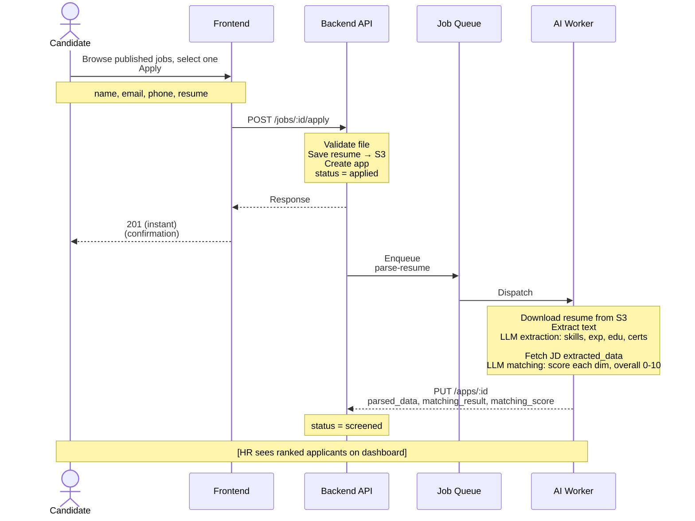
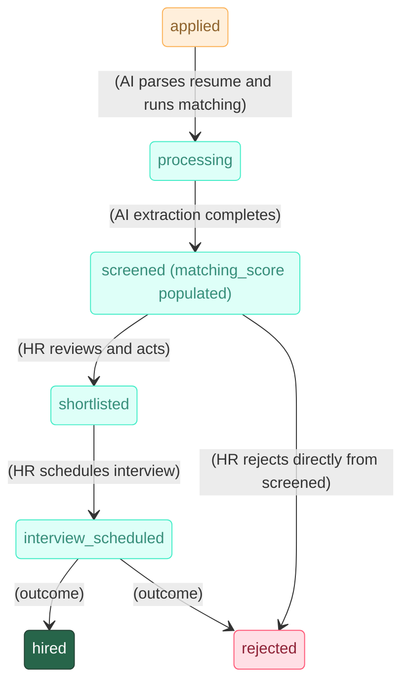
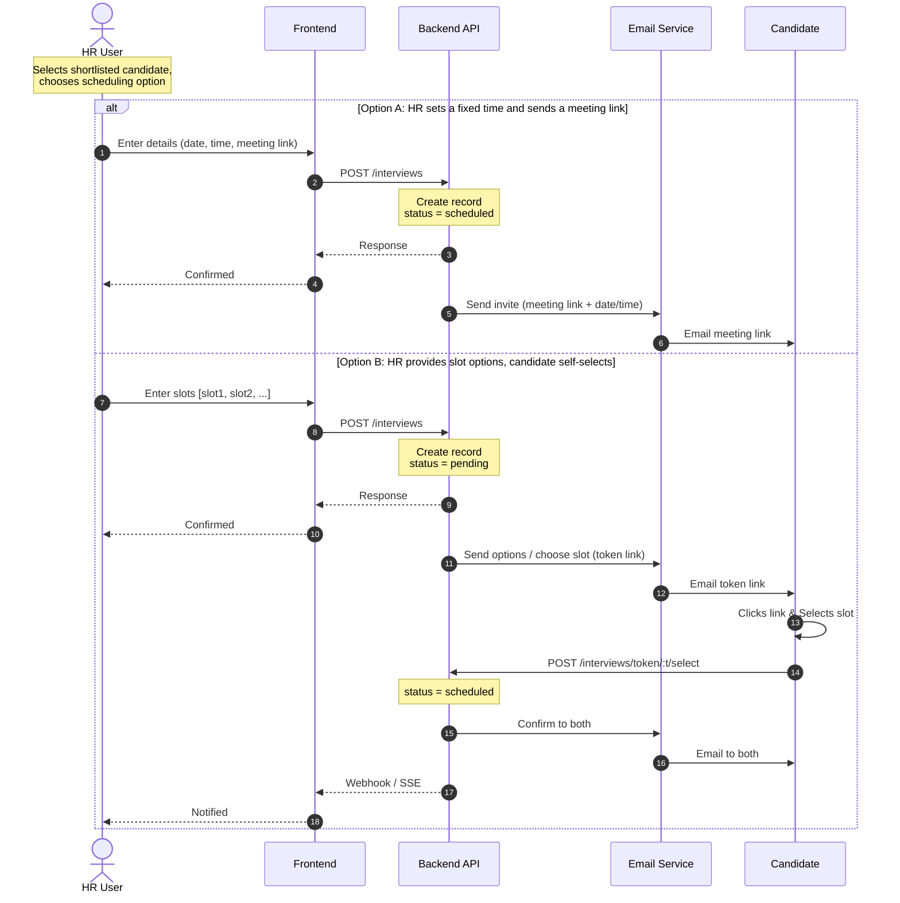

# AI-Powered Screening Requirements

## Document Information
- **Project**: AI-Recruit - AI-Powered Recruitment Platform
- **Scope**: AI assessment pipeline covering JD creation and candidate application
- **Version**: 2.0
- **Date**: July 7, 2026
- **Status**: Requirements Definition

---

## Table of Contents
1. [Overview](#overview)
2. [Context & Scope](#context--scope)
3. [User Stories](#user-stories)
4. [Functional Requirements - JD Processing](#functional-requirements--jd-processing)
5. [Functional Requirements - Resume Processing & Matching](#functional-requirements--resume-processing--matching)
6. [Functional Requirements - HR Dashboard & Ranking View](#functional-requirements--hr-dashboard--ranking-view)
7. [Functional Requirements - Interview Scheduling](#functional-requirements--interview-scheduling)
8. [Non-Functional Requirements](#non-functional-requirements)
9. [Data Requirements](#data-requirements)
10. [API Reference](#api-reference)
11. [Acceptance Criteria](#acceptance-criteria)


---

## 1. Overview

### What this document covers

This document specifies the requirements for the **automated AI assessment pipeline** that is the core of the AI-Recruit platform. It covers two primary workflows:

1. **JD Processing** - HR uploads or links a job description. The system extracts structured requirements from it using AI and stores them as queryable data.

2. **Resume Processing & Matching** - A candidate applies to a job and uploads a resume. The system extracts structured data from the resume and automatically scores and ranks the candidate against the JD requirements.

Both workflows run **entirely in the background**. The candidate and HR each get an instant response from the API. The AI processing happens asynchronously and updates the relevant records when complete.

### What this document does NOT cover


- Any form of real-time AI interaction with the candidate

---

## 2. Context & Scope

### Where this fits in the product



### Roles involved

| Role | Interaction with this feature |
|------|------------------------------|
| HR Manager | Publishes JD, views all ranked candidates, schedules interviews, manages applicant statuses |
| Recruiter | Creates/publishes JD, views candidates for own jobs, schedules interviews |
| Company Admin | Same as HR Manager plus company-level user management and configuration |
| Admin | System-wide visibility and management across all companies |
| Candidate | Applies to a job (no direct interaction with AI pipeline - it runs silently) |
| Guest (no account) | Can browse and apply without creating an account |

---

## 3. User Stories

### HR / Recruiter

| ID | Story |
|----|-------|
| US-101 | As an HR user, I want to upload a JD document so the system can extract requirements automatically and I don't have to fill in a form manually |
| US-102 | As an HR user, I want to provide a job title as the minimum required input so I always have a named JD record even if parsing is still in progress |
| US-103 | As an HR user, I want to see the AI-extracted JD data before publishing so I can review and correct it if needed |
| US-104 | As an HR user, I want to change the JD status (draft → published → closed) so I control when candidates can see it |
| US-105 | As an HR user, I want to see all applicants for a job ranked by their matching score so I can identify the best candidates immediately |
| US-106 | As an HR user, I want to see a breakdown of each candidate's score (skills, experience, education) so I understand why they ranked where they did |
| US-107 | As an HR user, I want to shortlist candidates and send them an interview invitation so the pipeline moves forward |
| US-108 | As an HR user, I want to send a meeting link directly to a candidate or give them time slot options to self-schedule so I can choose the approach that fits my workflow |

### Candidate

| ID | Story |
|----|-------|
| US-201 | As a candidate, I want to browse published jobs without needing an account so there is no friction before applying |
| US-202 | As a candidate, I want to apply to a job by providing my basic details and uploading my resume so the process is simple |
| US-203 | As a candidate, I want to receive confirmation that my application was received so I know it was submitted successfully |
| US-204 | As a candidate, I want to create an account so I can track my application status |

### Admin

| ID | Story |
|----|-------|
| US-301 | As an admin, I want to see all companies, users, and jobs across the platform so I can manage the system |
| US-302 | As an admin, I want to manage user roles so I can control access |

---

## 4. Functional Requirements - JD Processing

### Overview

When an HR user creates a job description, the system immediately creates a database record and returns a response. AI extraction then runs in the background as an async job.

### Flow




### JD Status Lifecycle



> **Note**: `extraction_failed` is a terminal state reached if AI processing fails. HR is notified in-app and can retry via `POST /jobs/:id/reprocess` or manually fill the data and publish. `published → draft` is also a valid transition (unpublish).

### Requirements

#### FR-101: Job Creation
- HR must provide a job title as mandatory input - no other field is required to create the record
- HR may optionally upload a document (PDF or DOCX) or provide a URL to the job posting
- System creates a JD record immediately with `status = draft`
- API endpoint `POST /jobs` must support an `Idempotency-Key` header to prevent duplicate JD creation on network retries
- System responds to the HR with 201 and the new record ID - no waiting for AI

#### FR-102: Document Handling
- Uploaded documents are stored in object storage before any processing begins
- Supported file formats: PDF, DOCX
- Maximum file size: 10MB
- File type is validated by MIME type and magic byte signature, not extension alone
- All uploaded files must be scanned for malware by the worker before processing. Infected files result in a failed extraction status.
- If a URL is provided instead of a file, the system fetches and caches the page content server-side

#### FR-103: AI Extraction - Job Description
- Extraction runs as an async background job after the record is created
- The AI service receives the raw text and returns a structured JSON object
- Extracted fields stored in `extracted_data` JSONB column:

  | Field | Type | Description |
  |-------|------|-------------|
  | `required_skills` | array | Must-have skills explicitly stated in JD |
  | `preferred_skills` | array | Good-to-have / bonus skills |
  | `minimum_experience_years` | number | Minimum years required |
  | `preferred_experience_years` | number | Preferred years if mentioned |
  | `education_requirements` | array | Required degrees or qualifications |
  | `certifications` | array | Named certifications required |
  | `job_type` | string | full-time / part-time / contract / internship |
  | `work_mode` | string | remote / hybrid / on-site |
  | `location` | string | City and country if mentioned |
  | `salary_range` | object | min, max, currency - only if explicitly stated |
  | `responsibilities` | array | Key duties of the role |
  | `role_summary` | string | 2-3 sentence summary of the role |

- Fields not found in the JD are stored as `null` - the AI must not infer or hallucinate values
- On extraction failure, the job is retried up to 3 times with exponential backoff
- If all retries fail, `status` is set to `extraction_failed`
- **Failure UX**: HR is notified via an in-app notification banner on the dashboard. The JD detail page displays an "Extraction Failed" state with a "Retry Processing" button (which calls `POST /jobs/:id/reprocess`) and allows manual entry of all fields.

#### FR-104: HR Review of Extracted Data
- Before publishing, HR can view all extracted fields on the JD detail page
- HR can edit any extracted field inline
- HR can manually fill fields that were not extracted
- Publishing is blocked until `title` is set and at least `required_skills` is non-empty

#### FR-105: Status Management
- HR can transition JD status manually:
  - `draft` → `published`
  - `published` → `closed`
  - `published` → `draft` (unpublish)
- Only `published` JDs are visible on the public job board
- `closed` JDs are no longer visible to candidates but remain accessible to HR


---

## 5. Functional Requirements - Resume Processing & Matching

### Overview

When a candidate applies, the system immediately creates an application record and returns a confirmation. Resume parsing and JD-matching then run sequentially as async background jobs.

### Flow



### Application Status Lifecycle



> **Note**: If resume extraction or matching fails after all retries, the status remains `applied` (or transitions to an error state if configured), and a fallback UI allows HR to review the original resume document manually without AI scores. Candidates are not shown internal failure states.

### Requirements

#### FR-201: Guest Application (No Account Required)
- Candidates can apply without creating an account
- Required fields on application form:
  - First name
  - Last name
  - Email address
  - Phone number
  - Resume file (PDF or DOCX, max 10MB)
- Optional field: cover letter (free text)
- API endpoint `POST /jobs/:id/apply` must support an `Idempotency-Key` header to prevent duplicate application errors on network retries
- One application per email per JD - duplicate attempt returns a descriptive error
- If the candidate's email already has an account, the application is linked to that account
- If not, a "ghost" application record is created without a user account to comply with GDPR consent requirements. An opt-in link is provided in the confirmation email to allow the candidate to create an account later if they wish to track their status.

#### FR-202: File Validation
- File type validated by MIME type and magic byte check
- Maximum file size: 10MB
- Only PDF and DOCX are accepted
- All uploaded files must be scanned for malware by the worker before processing
- Clear error message returned immediately if validation fails - no record is created

#### FR-203: AI Extraction - Resume
- Runs as an async background job after application record is created
- Extracts and stores in `parsed_data` JSONB column:

  | Field | Type | Description |
  |-------|------|-------------|
  | `candidate_summary` | string | 2-3 sentence professional summary |
  | `primary_skills` | array | Core technical skills |
  | `secondary_skills` | array | Supporting technical skills |
  | `domain_expertise` | array | Industry/domain knowledge |
  | `experience` | array | Each role: company, title, start date, end date, responsibilities |
  | `total_experience_years` | number | Calculated total, accounting for overlapping roles |
  | `education` | array | Degree, field, institution, graduation year |
  | `certifications` | array | Named certifications |
  | `languages` | array | Spoken languages with proficiency level |

- `total_experience_years` is calculated from all roles, not just summed - overlapping tenures are deduplicated
- Fields not found are stored as `null` - no inference
- On failure, retried up to 3 times with backoff

#### FR-204: AI Matching - Resume vs JD
- Runs immediately after resume extraction completes, as a chained async task
- Fetches the JD's `extracted_data` from the database
- Passes both datasets to the AI for comparison
- Matching output stored in `matching_result` JSONB column:

  | Field | Type | Description |
  |-------|------|-------------|
  | `skills_match.score` | 0.0-1.0 | Fraction of required skills present in resume |
  | `skills_match.matched_skills` | array | Skills found in both JD and resume |
  | `skills_match.missing_skills` | array | JD required skills absent from resume |
  | `experience_match.score` | 0.0-1.0 | How well experience level meets the JD requirement |
  | `experience_match.years_required` | number | From JD |
  | `experience_match.years_candidate_has` | number | From resume |
  | `education_match.score` | 0.0-1.0 | Whether education requirements are met |
  | `education_match.meets_requirements` | boolean | Simple pass/fail |
  | `overall_fit.score` | 0.0-10.0 | Weighted overall match score |
  | `overall_fit.recommendation` | string | strong_fit / moderate_fit / weak_fit / not_suitable |
  | `overall_fit.strengths` | array | Notable positives |
  | `overall_fit.concerns` | array | Notable gaps |
  | `overall_fit.summary` | string | 2-3 paragraph analysis |

#### FR-205: Matching Score Calculation

The `matching_score` field (float, 0-10) is a denormalised value stored directly on the application record for fast sorting. It is derived from the `matching_result` using a fixed weighted formula:

```
  matching_score =
    ( skills_match.score     × 0.40
    + experience_match.score  × 0.35
    + education_match.score   × 0.25 ) × 10
```

| Dimension | Weight | Rationale |
|-----------|--------|-----------|
| Skills match | 40% | Most direct signal of technical capability |
| Experience match | 35% | Seniority and role relevance |
| Education match | 25% | Threshold qualifier, less differentiating |

The score is always stored even if any individual dimension is `null` - missing dimensions score 0 for that component.

#### FR-206: Application Status Update
- After matching completes, `status` is updated from `applied` to `screened`
- `matching_score` and `years_of_experience` are written as denormalised columns alongside the JSONB
- HR is not notified per-application - the dashboard refreshes with updated scores


---

## 6. Functional Requirements - HR Dashboard & Ranking View

### Overview

After the AI pipeline runs, HR sees a ranked list of applicants per job. This is the primary interface for reviewing and acting on candidates.

### Applicant Ranking View

```
  ┌─────────────────────────────────────────────────────────────────────────┐
  │  Job: Senior Backend Engineer  │  48 applicants  │  36 screened         │
  ├─────────────────────────────────────────────────────────────────────────┤
  │  Filter: [All statuses ▼]   Sort: [Match score: High → Low ▼]           │
  ├────┬──────────────────┬───────┬────────────┬────────────┬───────────────┤
  │ #  │ Name             │ Score │ Skills     │ Experience │ Status        │
  ├────┼──────────────────┼───────┼────────────┼────────────┼───────────────┤
  │ 1  │ Alice Smith      │  9.2  │ ████████░░ │ 7 yrs      │ Screened      │
  │ 2  │ Bob Jones        │  8.7  │ ███████░░░ │ 5 yrs      │ Screened      │
  │ 3  │ Carol Lee        │  7.1  │ █████░░░░░ │ 4 yrs      │ Shortlisted   │
  │ …                                                                       │
  └─────────────────────────────────────────────────────────────────────────┘
```

### Requirements

#### FR-301: Applicant List
- List displays all applicants for a selected JD
- Default sort: `matching_score` descending
- HR can sort by: score, application date, name, years of experience
- HR can filter by: status, score range, years of experience range
- Pagination or infinite scroll - maximum 50 records per page
- List shows for each applicant: name, email, score (0-10), skills match bar, experience years, status badge

#### FR-302: Applicant Detail View
- Full candidate profile page accessible from the list
- Shows:
  - Candidate info (name, email, phone)
  - Resume download link
  - AI-extracted skills - matched skills highlighted green, missing required skills highlighted red
  - Experience timeline from parsed resume
  - Education and certifications
  - Score breakdown: skills (40%) / experience (35%) / education (25%) displayed visually
  - AI analysis summary (strengths, concerns, recommendation)
  - Application status and history

#### FR-303: Status Actions
- HR can change application status from the detail view:
  - `screened` → `shortlisted`
  - `screened` → `rejected`
  - `shortlisted` → `rejected`
  - `shortlisted` → `interview_scheduled` (triggers scheduling flow)
- Status changes are immediate and logged in audit trail

#### FR-304: Bulk Actions
- HR can select multiple applicants from the list
- Available bulk actions: shortlist selected, reject selected
- Bulk rejection triggers a configurable rejection email template

---

## 7. Functional Requirements - Interview Scheduling

### Overview

Once a candidate is shortlisted, HR can schedule an interview. Two options exist: HR sends a direct invite, or HR provides time slots for the candidate to self-select.

### Flow



### Requirements

#### FR-401: Option A - HR Direct Invite
- HR enters: scheduled date and time, meeting link (e.g. Google Meet, Zoom - any URL)
- System creates interview record with `status = scheduled`
- System sends email to candidate containing the meeting link, date/time, and job title
- Email includes a calendar invite attachment (.ics)

#### FR-402: Option B - Candidate Self-Scheduling
- HR enters 2-5 time slot options
- System generates a unique, single-use token-based scheduling URL for the candidate
- System emails candidate with the scheduling URL and a deadline (default 48 hours)
- Candidate visits the URL, selects preferred slot
- System marks the interview as `status = scheduled` with the selected slot
- System sends confirmation email to both HR and candidate, with calendar invite
- If no slot is selected before the deadline, HR is notified

#### FR-403: Notifications
- Candidate receives: invitation email (both options), confirmation email (Option B), reminder 24h before, reminder 1h before
- HR receives: confirmation when candidate self-schedules (Option B), notification if deadline passes without selection

#### FR-404: Interview Record
- Every interview schedule is a separate record linked to the application
- Fields: `application_id`, `interview_type` (initial, technical, hr, final), `status`, `scheduled_at`, `meeting_link`, `time_slot_options` (JSONB), `scheduling_token`
- Multiple interview records per application are supported (one per round)

---

## 8. Non-Functional Requirements

### Performance

| Requirement | Target |
|-------------|--------|
| API response time for job creation | < 500ms |
| API response time for application submission | < 500ms |
| JD AI extraction completion | < 2 minutes from upload |
| Resume AI extraction completion | < 90 seconds from submission |
| Matching score available after extraction | < 30 seconds |
| Applicant list load time (50 records) | < 1 second |

### Reliability

| Requirement | Target |
|-------------|--------|
| AI task retry on failure | Up to 3 retries, exponential backoff |
| Data loss on task failure | Zero - record exists before task runs |
| System availability | 99.5% uptime |
| Recovery from failed AI task | Manual re-trigger via admin endpoint |

### Scalability

| Requirement | Target |
|-------------|--------|
| Concurrent job applications | 500+ per minute |
| Concurrent AI parsing tasks | 100+ without queue degradation |
| Applications per JD | No hard limit |
| JDs per company | No hard limit |

### Security

- All file uploads validated by the worker before AI processing (MIME type, magic bytes, malware)
- Uploaded files stored in private object storage - never publicly accessible
- Resume downloads via signed URLs with a short TTL (15 minutes)
- All API endpoints require authentication except public job browsing and application submission
- Application submission rate-limited per IP (5 per hour per JD)
- Candidate email uniqueness enforced per JD at the database level

---

## 9. Data Requirements

### JSONB Schema - JD `extracted_data`

```
{
  "required_skills":           [ "Python", "PostgreSQL", "REST APIs" ],
  "preferred_skills":          [ "Kubernetes", "GraphQL" ],
  "minimum_experience_years":  3,
  "preferred_experience_years": 5,
  "education_requirements":    [ "Bachelor's in Computer Science or related" ],
  "certifications":            [],
  "job_type":                  "full-time",
  "work_mode":                 "hybrid",
  "location":                  "Mumbai, India",
  "salary_range":              { "min": 1200000, "max": 1800000, "currency": "INR" },
  "responsibilities":          [ "Design and maintain backend services", ... ],
  "role_summary":              "..."
}
```

### JSONB Schema - Application `parsed_data` (resume)

```
{
  "candidate_summary":        "...",
  "primary_skills":           [ "Python", "FastAPI", "PostgreSQL" ],
  "secondary_skills":         [ "Docker", "Redis" ],
  "domain_expertise":         [ "FinTech", "e-commerce" ],
  "experience": [
    {
      "company":          "Acme Corp",
      "title":            "Backend Engineer",
      "start_date":       "2021-06",
      "end_date":         "2024-03",
      "duration_months":  33,
      "responsibilities": [ "..." ],
      "technologies":     [ "Python", "Django" ]
    }
  ],
  "total_experience_years":   4.5,
  "education": [
    {
      "degree":           "B.Tech",
      "field":            "Computer Science",
      "institution":      "IIT Bombay",
      "graduation_year":  "2019"
    }
  ],
  "certifications":           [ "AWS Certified Developer" ],
  "languages":                [ "English (fluent)", "Hindi (native)" ]
}
```

### JSONB Schema - Application `matching_result`

```
{
  "skills_match": {
    "score":           0.85,
    "matched_skills":  [ "Python", "PostgreSQL", "REST APIs" ],
    "missing_skills":  [ "Kubernetes" ]
  },
  "experience_match": {
    "score":                  0.90,
    "years_required":         3,
    "years_candidate_has":    4.5,
    "relevant_experience":    "4+ years of backend engineering..."
  },
  "education_match": {
    "score":                  1.0,
    "meets_requirements":     true
  },
  "overall_fit": {
    "score":           8.7,
    "recommendation":  "strong_fit",
    "strengths":       [ "Strong Python skills", "Exceeds experience requirement" ],
    "concerns":        [ "No Kubernetes experience" ],
    "summary":         "..."
  }
}
```

### Denormalised columns on applications table

In addition to the JSONB blob, the following are stored as typed columns for fast querying without JSON parsing:

| Column | Type | Source |
|--------|------|--------|
| `matching_score` | float (0-10) | Calculated from `matching_result` |
| `years_of_experience` | integer | Extracted from `parsed_data.total_experience_years` |

---

## 10. API Reference

### Job Descriptions

```
POST   /api/v1/jobs                        Create JD (title required, doc/URL optional)
GET    /api/v1/jobs                        List HR's company JDs (auth required)
GET    /api/v1/jobs/:id                    Get JD detail (auth required)
PUT    /api/v1/jobs/:id                    Update JD (edit extracted data, title, etc.)
DELETE /api/v1/jobs/:id                    Delete JD (draft or closed only)
PATCH  /api/v1/jobs/:id/status             Change status (publish, close, unpublish)
POST   /api/v1/jobs/:id/reprocess          Trigger re-extraction (admin/HR)

GET    /api/v1/public/jobs                 Browse published jobs (no auth)
GET    /api/v1/public/jobs/:id             View published JD detail (no auth)
```

### Applications

```
POST   /api/v1/public/jobs/:id/apply       Submit application (no auth required)
GET    /api/v1/jobs/:id/applicants         List ranked applicants for a JD (auth)
GET    /api/v1/applications/:id            Get application detail (auth)
PATCH  /api/v1/applications/:id/status     Update status (shortlist, reject)
POST   /api/v1/applications/:id/reprocess  Trigger re-parsing and re-scoring (admin/HR)
```

### Interview Scheduling

```
POST   /api/v1/interviews                  Create interview invitation
GET    /api/v1/interviews/:id              Get interview details
PUT    /api/v1/interviews/:id              Update interview (change time, link)
DELETE /api/v1/interviews/:id              Cancel interview
GET    /api/v1/interviews/schedule/:token  Public page - candidate views slot options
POST   /api/v1/interviews/schedule/:token  Candidate selects a slot
```

### Admin

> **Architectural Note**: The System Design consolidates all administrative operations under standard resource URLs protected by RBAC. There is no separate `/admin/` namespace - the authenticated user's role (`super_admin`, `company_admin`) determines the scope of data returned and operations permitted. See [SYSTEM_DESIGN.md](../architecture/SYSTEM_DESIGN.md) §5 and §6 for details.

```
GET    /api/v1/users                       List users (role-scoped: all or own company)
POST   /api/v1/users                       Create user (role-scoped)
PUT    /api/v1/users/:id                   Update user / change role (role-scoped)
DELETE /api/v1/users/:id                   Deactivate user (role-scoped)
GET    /api/v1/companies                   List companies (super_admin only)
POST   /api/v1/companies                   Create company (super_admin only)
GET    /api/v1/system/health               Health check (super_admin only)
```

---

## 11. Acceptance Criteria

### AC-001: JD creation with document
**Given** an HR user submits a job title and a PDF document  
**When** the API processes the request  
**Then** a JD record is created with `status = draft` and the API responds with 201 in under 500ms  
**And** within 2 minutes the `extracted_data` is populated with skills, experience, and other fields  
**And** the JD status remains `draft` (awaiting HR review)

### AC-002: JD creation - title only
**Given** an HR user submits only a job title (no document, no URL)  
**When** the API processes the request  
**Then** a JD record is created and returned immediately  
**And** `extracted_data` remains empty  
**And** HR can manually populate fields before publishing

### AC-003: Publishing gate
**Given** a JD has `required_skills` populated (either by AI or manually)  
**When** HR clicks publish  
**Then** the status changes to `published` and the JD appears on the public job board  

**Given** a JD has no `required_skills`  
**When** HR attempts to publish  
**Then** the system returns a validation error explaining what is missing

### AC-004: Guest application
**Given** a published JD exists  
**When** a candidate submits their name, email, phone, and a valid PDF resume without being logged in  
**Then** an application record is created with `status = applied` and a 201 is returned in under 500ms  
**And** a confirmation email is sent to the candidate

### AC-005: Duplicate application blocked
**Given** a candidate with email `alice@example.com` already has an application for JD `xyz`  
**When** the same email submits another application for JD `xyz`  
**Then** the API returns a 422 with a clear error message  
**And** no duplicate record is created

### AC-006: Resume scoring
**Given** an application exists and the JD has `extracted_data` populated  
**When** the AI parsing and matching pipeline completes  
**Then** the application `status` is updated to `screened`  
**And** `matching_score` is a float between 0 and 10  
**And** `matching_result` contains scores for skills, experience, and education  
**And** `matched_skills` and `missing_skills` are populated

### AC-007: Ranked applicant list
**Given** a JD has 10 or more screened applicants  
**When** HR opens the applicant list for that JD  
**Then** applicants are sorted by `matching_score` descending by default  
**And** each row shows the candidate's name, score, matched skills bar, experience years, and status

### AC-008: Interview invitation - direct
**Given** HR has shortlisted a candidate and chooses Option A  
**When** HR submits a date, time, and meeting link  
**Then** the candidate receives an email within 2 minutes containing the meeting link and time  
**And** the interview record is created with `status = scheduled`

### AC-009: Interview invitation - self-schedule
**Given** HR has shortlisted a candidate and chooses Option B with 3 time slots  
**When** the candidate clicks the scheduling link and selects a slot  
**Then** the interview record is updated to `status = scheduled` with the selected time  
**And** confirmation emails are sent to both the candidate and the HR user


---

**Document End**
